## **Table of Contents**

1. [Acknowledgements](#acknowledgements)
2. [Setting up, getting started](#setting-up-getting-started)
3. [Design](#design)
    * [Architecture](#architecture)
    * [UI component](#ui-component)
    * [Logic component](#logic-component)
    * [Model component](#model-component)
    * [Storage component](#storage-component)
    * [Common classes](#common-classes)
4. [Implementation](#implementation)
    * [Filter feature](#filter-feature)
    * [FriendFolio Predicates](#friendfolio-predicates)
    * [Remark Command](#remark-command)
    * [Lend Command](#lend-command)
    * [Split Command](#split-command)
    * [PayNow](#paynow)
    * [Sort Command](#sort-command)
    * [Proposed Undo/redo feature](#proposed-undoredo-feature)
5. [Documentation, logging, testing, configuration, dev-ops](#documentation-logging-testing-configuration-dev-ops)
6. [Appendix: Requirements](#appendix-requirements)
    * [Product Scope](#product-scope)
    * [User Stories](#user-stories)
    * [Use Cases](#use-cases)
    * [Non-Functional Requirements](#non-functional-requirements)
    * [Glossary](#glossary)
7. [Appendix: Planned Enhancements](#appendix-planned-enhancements)
8. [Appendix: Instructions for manual testing](#appendix-instructions-for-manual-testing)

--------------------------------------------------------------------------------------------------------------------

## **Acknowledgements**

[//]: # (* {list here sources of all reused/adapted ideas, code, documentation, and third-party libraries -- include links to the original source as well})

* https://github.com/poonchuanan/Python-PayNow-QR-Code-Generator was referred to for the format of PayNow QR codes as
  well as the CRC-16 algorithm.

--------------------------------------------------------------------------------------------------------------------

## **Setting up, getting started**

Refer to the guide [_Setting up and getting started_](SettingUp.md).

--------------------------------------------------------------------------------------------------------------------

## **Design**

:bulb: **Tip:** The `.puml` files used to create diagrams in this document `docs/diagrams` folder. Refer to the [
_PlantUML Tutorial_ at se-edu/guides](https://se-education.org/guides/tutorials/plantUml.html) to learn how to create
and edit diagrams.

### Architecture

The ***Architecture Diagram*** given above explains the high-level design of the App.

Given below is a quick overview of main components and how they interact with each other.

**Main components of the architecture**

**`Main`** (consisting of
classes [`Main`](https://github.com/AY2324S2-CS2103T-T16-2/tp/tree/master/src/main/java/seedu/address/Main.java)
and [`MainApp`](https://github.com/AY2324S2-CS2103T-T16-2/tp/tree/master/src/main/java/seedu/address/MainApp.java)) is
in charge of the app launch and shut down.

* At app launch, it initializes the other components in the correct sequence, and connects them up with each other.
* At shut down, it shuts down the other components and invokes cleanup methods where necessary.

The bulk of the app's work is done by the following four components:

* [**`UI`**](#ui-component): The UI of the App.
* [**`Logic`**](#logic-component): The command executor.
* [**`Model`**](#model-component): Holds the data of the App in memory.
* [**`Storage`**](#storage-component): Reads data from, and writes data to, the hard disk.

[**`Commons`**](#common-classes) represents a collection of classes used by multiple other components.

**How the architecture components interact with each other**

The *Sequence Diagram* below shows how the components interact with each other for the scenario where the user issues
the command `delete 1`.

Each of the four main components (also shown in the diagram above),

* defines its *API* in an `interface` with the same name as the Component.
* implements its functionality using a concrete `{Component Name}Manager` class (which follows the corresponding
  API `interface` mentioned in the previous point.

For example, the `Logic` component defines its API in the `Logic.java` interface and implements its functionality using
the `LogicManager.java` class which follows the `Logic` interface. Other components interact with a given component
through its interface rather than the concrete class (reason: to prevent outside component's being coupled to the
implementation of a component), as illustrated in the (partial) class diagram below.

The sections below give more details of each component.

### UI component

The UI component has been enhanced with the addition of a new `DisplayCard` element. This element is responsible for
displaying the currently selected contact's detailed information, enhancing the user experience by providing a more
interactive and comprehensive view of contact details.

The **API** of this component is specified
in [`Ui.java`](https://github.com/AY2324S2-CS2103T-T16-2/tp/tree/master/src/main/java/seedu/address/ui/Ui.java)

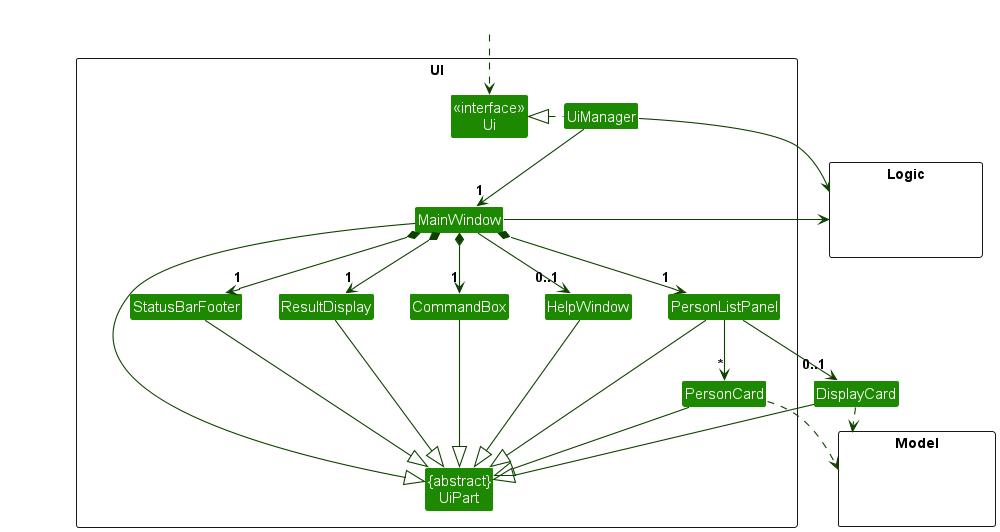

The UI consists of a `MainWindow` that is made up of parts
e.g.`CommandBox`, `ResultDisplay`, `PersonListPanel`, `StatusBarFooter` etc, and the newly added `DisplayCard`.
All these, including the `MainWindow`, inherit from the abstract `UiPart` class which captures the commonalities
between classes that represent parts of the visible GUI.

The `UI` component uses the JavaFx UI framework. The layout of these UI parts are defined in matching `.fxml` files that
are in the `src/main/resources/view` folder. For example, the layout of
the [`MainWindow`](https://github.com/AY2324S2-CS2103T-T16-2/tp/tree/master/src/main/java/seedu/address/ui/MainWindow.java)
is specified
in [`MainWindow.fxml`](https://github.com/AY2324S2-CS2103T-T16-2/tp/tree/master/src/main/resources/view/MainWindow.fxml)

The `UI` component,

* executes user commands using the `Logic` component.
* listens for changes to `Model` data so that the UI can be updated with the modified data.
* keeps a reference to the `Logic` component, because the `UI` relies on the `Logic` to execute commands.
* depends on some classes in the `Model` component, as it displays `Person` object residing in the `Model`.

### Logic component

**API** : [`Logic.java`](https://github.com/AY2324S2-CS2103T-T16-2/tp/tree/master/src/main/java/seedu/address/logic/Logic.java)

Here's a (partial) class diagram of the `Logic` component:

The sequence diagram below illustrates the interactions within the `Logic` component, taking `execute("delete 1")` API
call as an example.

:information_source: **Note:** The lifeline for `DeleteCommandParser` should end at the destroy marker (X) but due to a limitation of PlantUML, the lifeline continues till the end of diagram.

How the `Logic` component works:

1. When `Logic` is called upon to execute a command, it is passed to an `AddressBookParser` object which in turn creates
   a parser that matches the command (e.g., `DeleteCommandParser`) and uses it to parse the command.
1. This results in a `Command` object (more precisely, an object of one of its subclasses e.g., `DeleteCommand`) which
   is executed by the `LogicManager`.
1. The command can communicate with the `Model` when it is executed (e.g. to delete a person). 
   Note that although this is shown as a single step in the diagram above (for simplicity), in the code it can take
   several interactions (between the command object and the `Model`) to achieve.
1. The result of the command execution is encapsulated as a `CommandResult` object which is returned back from `Logic`.

Here are the other classes in `Logic` (omitted from the class diagram above) that are used for parsing a user command:

How the parsing works:

* When called upon to parse a user command, the `AddressBookParser` class creates an `XYZCommandParser` (`XYZ` is a
  placeholder for the specific command name e.g., `AddCommandParser`) which uses the other classes shown above to parse
  the user command and create a `XYZCommand` object (e.g., `AddCommand`) which the `AddressBookParser` returns back as
  a `Command` object.
* All `XYZCommandParser` classes (e.g., `AddCommandParser`, `DeleteCommandParser`, ...) inherit from the `Parser`
  interface so that they can be treated similarly where possible e.g, during testing.

Directly executing commands without user input:

* The application has instances where some function might be performed on a button click instead of a user input.
* In such cases, the flow bypasses the need to parse a user input, and we directly pass a `Command` object into
  the `Logic` class to be executed.

The following sequence diagram illustrates how the components interact with each other when a user clicks on a button to
reset the debt they have with a specific `Person`.

### Model component

**API** : [`Model.java`](https://github.com/AY2324S2-CS2103T-T16-2/tp/tree/master/src/main/java/seedu/address/model/Model.java)

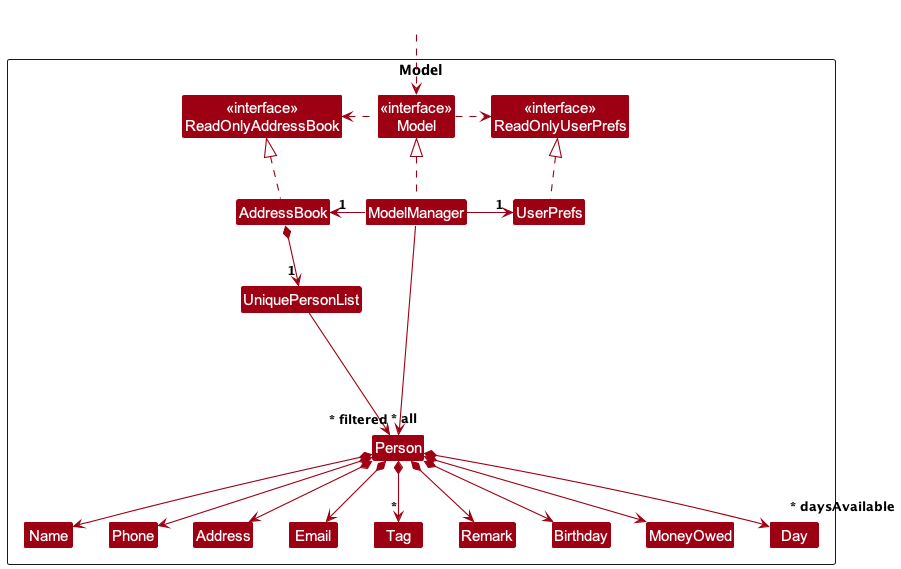

The `Model` component,

* stores the address book data i.e., all `Person` objects (which are contained in a `UniquePersonList` object).
* stores a separate _sorted_ list of `Person` objects (e.g., results of a sort query) which is then used to construct
  the filtered list below
* stores the currently 'selected' `Person` objects (e.g., results of a filter query) as a separate _filtered_ list which
  is exposed to outsiders as an unmodifiable `ObservableList<Person>` that can be 'observed' e.g. the UI can be bound to
  this list so that the UI automatically updates when the data in the list change.
* stores a `UserPref` object that represents the user’s preferences. This is exposed to the outside as
  a `ReadOnlyUserPref` objects.
* does not depend on any of the other three components (as the `Model` represents data entities of the domain, they
  should make sense on their own without depending on other components)

:information_source: **Note:** An alternative (arguably, a more OOP) model is given below. It has a `Tag` list in the `AddressBook`, which `Person` references. This allows `AddressBook` to only require one `Tag` object per unique tag, instead of each `Person` needing their own `Tag` objects. 

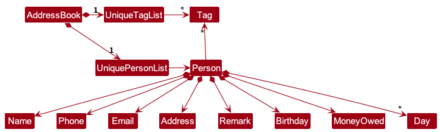

### Storage component

**API** : [`Storage.java`](https://github.com/AY2324S2-CS2103T-T16-2/tp/tree/master/src/main/java/seedu/address/storage/Storage.java)

The `Storage` component,

* can save both address book data and user preference data in JSON format, and read them back into corresponding
  objects.
* inherits from both `AddressBookStorage` and `UserPrefStorage`, which means it can be treated as either one (if only
  the functionality of only one is needed).
* depends on some classes in the `Model` component (because the `Storage` component's job is to save/retrieve objects
  that belong to the `Model`)

### Common classes

Classes used by multiple components are in the `seedu.addressbook.commons` package.

--------------------------------------------------------------------------------------------------------------------

## **Implementation**

This section describes some noteworthy details on how certain features are implemented.

### Filter feature

#### Introduction 
FriendFolio can filter contacts by tags, days available (in a week) and by name using FilterCommand.
FilterCommand can also specify whether the filter is any-match or all-match with respect to the keywords using
the `--all` flag (it is by default any-match).

Note that the `--all` flag is implemented using ArgumentMultimap, and it must be placed at the end of the command,
for example:

`filter tag friends colleagues --all`

Any text after `--all` is not parsed, but will produce the same result as the above command instead of throwing an error.

#### Implementation
To reduce code duplication, the abstract FilterCommand extracts identical methods of 3 commands
(FilterNameCommand, FilterTagCommand, FilterDayCommand). Each command now inherits `execute` from FilterCommand,
and has their own error message and command specific information. The filter feature is implemented as follows:

1. The `filter` command syntax is parsed by FilterCommandParser, where the type of filter
(e.g. by tags, days available (in a week) or name) and the `--all` flag are parsed to create the respective 
Predicates.
2. The created Predicates are used to instantiate their respective FilterCommands which inherit `execute`
from the abstract FilterCommand class.
3. The common `execute` function modifies the `ObservableList<Person>` in the `Model` component to show the newly-filtered list.

The sequence diagram below shows how the components interact with each other when the user enters the command `filter tag friend`.

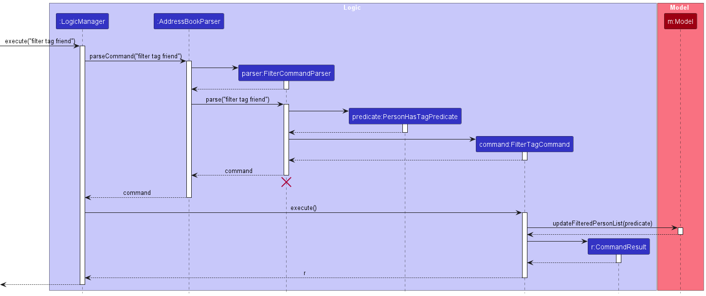

#### FriendFolio Predicates

Predicates in FriendFolio take in both a list of keywords to match, and a boolean to handle the all-match condition. 
There are currently 3 predicates: `NameContainsKeyWordPredicate`, `PersonAvailableOnDayPredicate`, `PersonHasTagPredicate`.

#### Alternatives Considered
1. Single FilterCommand Class: Initially considered using a single FilterCommand class to handle every specified filter 
type (day, name, tag). This approach was discarded because it is less extensible and OOP.
2. FilterCommand as an Interface: This approach was discarded because of near-identical method logic across 
FilterNameCommand, FilterTagCommand and FilterDayCommand which meant significant code-duplication.

#### UML Diagram
Refer to the below class diagram to visualize the relationships between FilterCommand, commands inheriting from FilterCommand
and predicates.

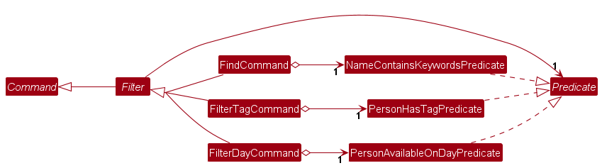

### Remark Command

#### Introduction

The Remark Command allows users to add or remove remarks for a person in the address book.
This feature enhances the app's usability by enabling users to store additional information about a contact that doesn't
fit into the standard fields like name, phone, or email.

#### Implementation

The RemarkCommand is implemented in the following steps:

1. The user inputs a command in the format remark `INDEX r/REMARK`, where `INDEX` is the position of the person in the
   current
   list, and `REMARK` is the new remark for the person.
2. The AddressBookParser parses the input and creates a new `RemarkCommand` object.
   The `RemarkCommand` executes by:
    - Retrieving the person to edit from the model based on the index.
    - Creating a new Person object with the updated remark and other details unchanged.
    - Replacing the old person object in the model with the updated one.
3. The UI is then updated to display the person's details with the new remark.

This implementation ensures that the app's performance is unaffected by the addition of remarks, as it reuses the
existing infrastructure for modifying person details.

#### Alternatives Considered

1. Storing Remarks Separately: Initially considered storing remarks in a separate map with the Person as the key.
   This approach was discarded because it complicated the model's state management and increased the risk of data
   inconsistency.
2. Extending Person Model: Another option was to extend the Person model to include remarks as a mandatory field.
   However, this was not ideal as remarks are optional and should not affect the creation of Person objects.

#### UML Diagram

To illustrate the interaction between components for the remark command, a sequence diagram is provided:

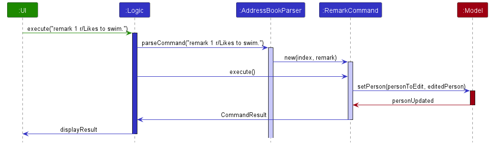

### Lend Command

#### Implementation Overview

After the `AddressBookParser` identifies that the user's input is calling the `lend` command word, it creates a
`LendCommandParser`. The `LendCommandParser` then parses the user's input and creates a new `LendCommand`
containing one `Index`. The `LendCommand` is then executed by `LogicManager`, which updates the
`MoneyOwed` attribute in `Person`. A `CommandResult` which stores the message of the outcome of lend command is
then returned. Part of the class diagram is shown below.

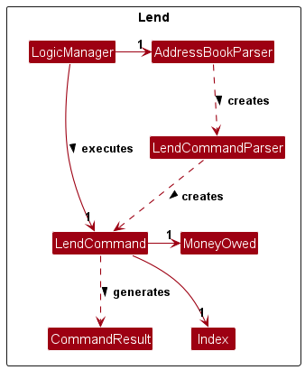

When the `LendCommand` executes, it checks if the `Index` is valid based on the last displayed list.
If it is valid, the `MoneyOwed` of the target person will be updated with the new amount.
The following activity diagram sums up the workflow of what happens when the user keys in a lend command.

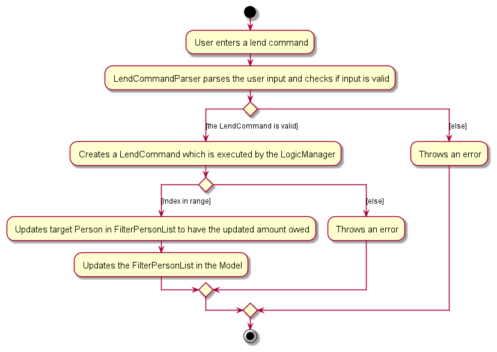

### Split Command

#### Implementation Overview

After the `AddressBookParser` identifies that the user's input is calling the `split` command word, it creates a
`SplitCommandParser`. The `SplitCommandParser` then parses the user's input and creates a new `SplitCommand`
containing one `MoneyOwed` object with the amount to split and at least one `Index`. The `SplitCommand` is then
executed by `LogicManager`, which updates the `MoneyOwed` attribute in `Person`. A `CommandResult` which stores
the message of the outcome of split command is then returned. Part of the class diagram is shown below.

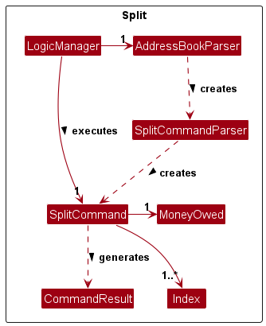

The following activity diagram sums up the workflow of what happens when the user keys in a split command.

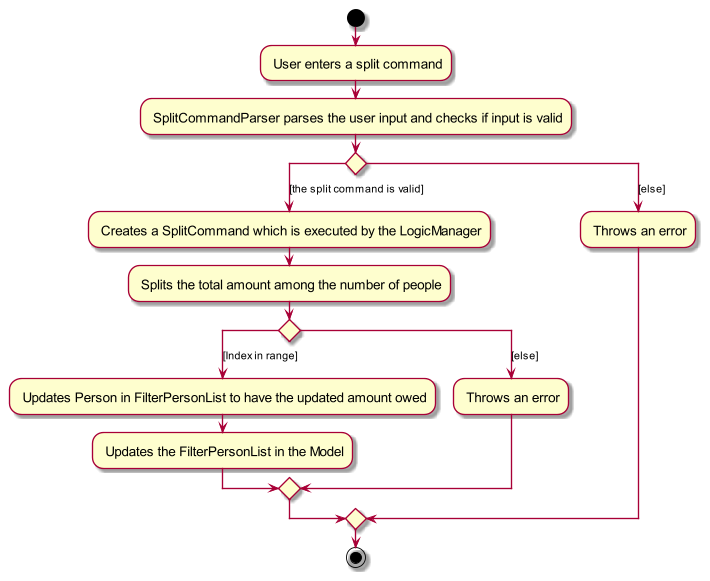

This implementation considers the user as an active participant in the split. For example, when the user enters two
indexes, the total amount is evenly divided among the user and the two specified individuals.

#### Alternatives Considered

1. Implementing unequal splits of money owed among contacts. However, this approach would necessitate manual
calculations and the input of specific values for each contact, thereby undermining the primary advantage of the
split command — to simplify and automate the distribution process. For scenarios requiring specific, manually
determined amounts, users can utilize the `lend` command, which is designed for financial entry for a single contact.

### PayNow

PayNow QR codes are basically encoded string, further encoded into a QR code. The string follow a specific format and
can be generated offline. The specifications of the format have been referenced
from [this repo](https://github.com/poonchuanan/Python-PayNow-QR-Code-Generator).

Basically, the string represents an object (similar to JSON) and it contains "fields" (similar to JSON attributes). In
one of the required fields is a nested object.

The class diagram is as such:

`PayNowPayload` is the aforementioned representation of an object. One `PayNowPayload` can contain
multiple `PaynowField`s.

`PayNowCode` is what we encode into the QR code that we can then scan. One of the fields contain
a `MerchantAccountInformation`, which is also a `PayNowPayload` itself (which is the nested object that had been
mentioned above).

We then call PayNowCode's static method, passing in a phone number and an initial amount (that will be autofilled when
users scan the QR code with their banking application), to generate the QR code.

### Sort Command

FriendFolio can sort contacts in 4 different ways:

1. Name `name`
2. Money Owed `money`
3. Closest upcoming birthday `birthday`
4. Time they were added into FriendFolio (Default) `clear`

For example: `sort name`

We use a [`SortedList`](https://docs.oracle.com/javase/8/javafx/api/javafx/collections/transformation/SortedList.html) to facilitate dynamic sorting by allowing the updating of a `Comparator`. This enables users to toggle between various sorting methods seamlessly.

This `SortedList` is then used in the constructor of a [`FilteredList`](https://docs.oracle.com/javase/8/javafx/api/javafx/collections/transformation/FilteredList.html) which is used in the [implementation of the filter feature](#filter-feature).

The `FilteredList` is then used by the UI to display the contacts in the specified order and filters because any changes in the ordering of the contacts from the `SortedList` will be propagated to the `FilteredList`, which will then reflect in the GUI.

For the first 3 sort types, a static `Comparator<Person>` is implemented inside the respective classes themselves (e.g. `Name`, `MoneyOwed`, `Birthday`).
When executing the command, the model will call the `updatePersonComparator` inside the `Model` class. A `null` is passed in as the comparator if `sort clear` is executed.

The _sequence diagram_ below shows how the components interact with each other when the user enters the command `sort name`.

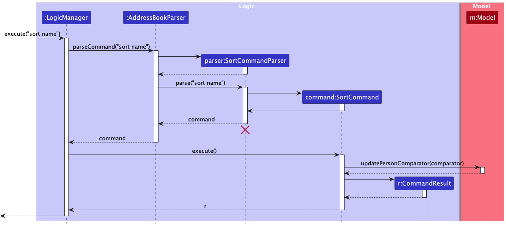

### Home Page UI

##### Overview

`HomeCard` is a new feature in the UI component designed to provide users with a quick overview of crucial information immediately upon application launch. It serves as a dynamic dashboard, displaying the current date and time, the total number of contacts, a summary of financial transactions, and a list of contacts available for the day.

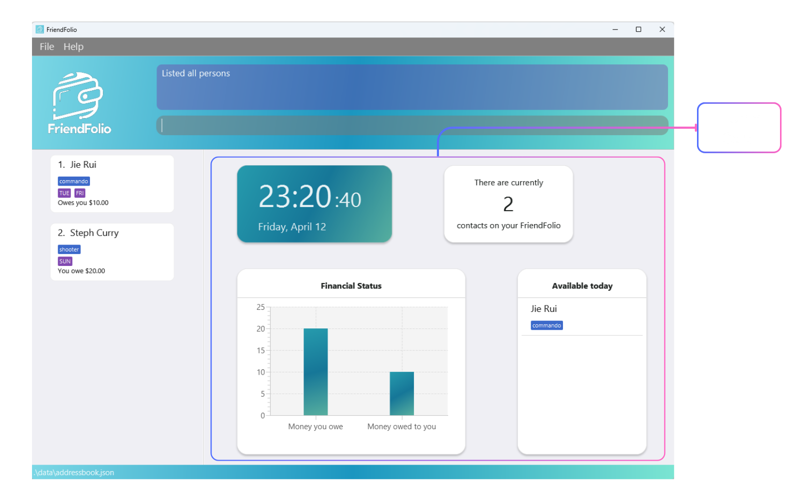

##### Implementation

The `HomeCard` is implemented using JavaFX and is integrated into the main window of the application. It interacts directly with the `Model` component to fetch real-time updates, ensuring that all displayed information reflects the latest data.

Key features include:

- **Real-Time Clock**: Utilizing Java's `LocalDateTime` and `Timeline` to update every second.
- **Contact Counter**: Dynamically updates as contacts are added or removed.
- **Financial Overview**: Uses a `BarChart` to graphically display money owed and owing.
- **Availability List**: Shows contacts available today based on their schedules.

#### Detailed Design

The layout for `HomeCard` is defined in `HomeCard.fxml`, organized to provide immediate access to its features, which are essential for enhancing user interaction and providing a comprehensive view at a glance.

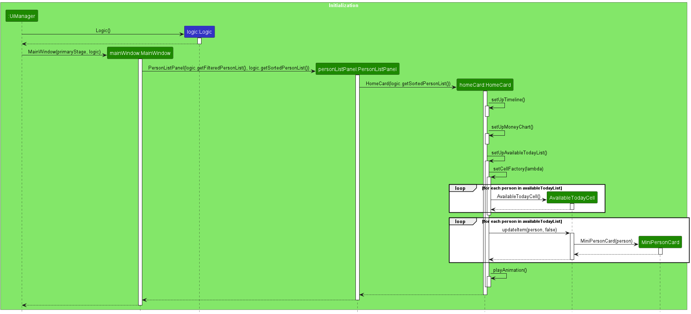

### MiniPersonCard component

#### Overview

Embedded within the `HomeCard`, the `MiniPersonCard` serves as a compact display module for contacts available on the current day. It offers a quick snapshot of essential contact details, enhancing the `HomeCard` functionality by allowing users to identify key information swiftly.

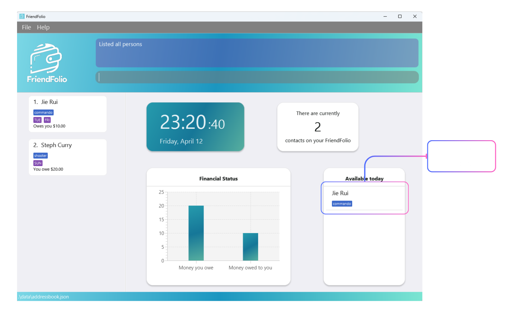

#### Functionality

Each `MiniPersonCard` represents an individual contact, showcasing brief but pertinent details such as the contact's name and their availability status. This component is utilized in the `ListView` of the `HomeCard` to enumerate all contacts who are available today.

#### Design

Like `DisplayCard`, `MiniPersonCard` is built using JavaFX and defined in `MiniPersonCard.fxml`. The design is minimalistic, focusing on displaying only the most relevant information to maintain the streamlined nature of the `HomeCard`'s overview purpose.

#### Integration into HomeCard

`MiniPersonCard` integrates seamlessly into the `HomeCard` to provide a dynamic list that updates daily, showing which contacts are available based on their schedules. This integration is crucial for users who need to quickly assess their contacts' availability without navigating away from the home screen.

### DisplayCard component

#### Overview

The `DisplayCard` enhances the UI by providing detailed information about a selected contact. This component is designed to improve user interaction by offering a more comprehensive and interactive view of contact details.

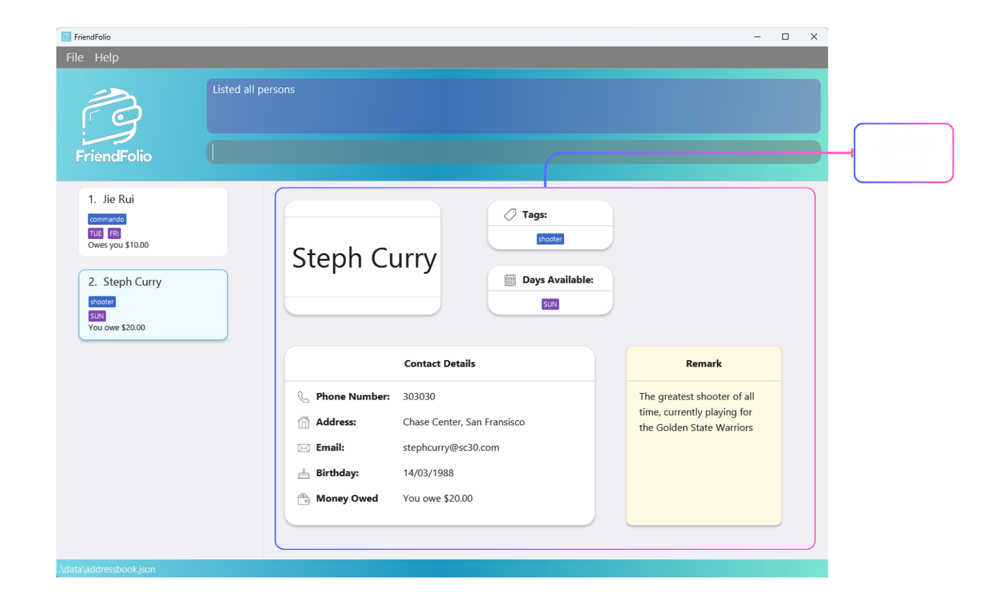

#### Functionality

`DisplayCard` is responsible for displaying extensive details about a contact, such as name, tags, birthday, and other personal details like debt or remarks. It updates in real-time when users select different contacts within the application.

#### Design

The implementation of `DisplayCard` relies on JavaFX, and its layout is managed via `DisplayCard.fxml`. It subscribes to updates from the `Model` component to ensure the displayed information is always current, reflecting any changes made to the contact information immediately.

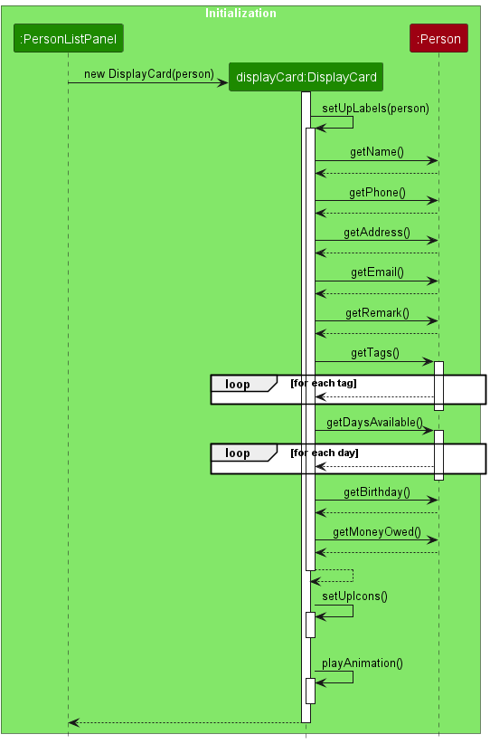

### \[Proposed\] Undo/redo feature

#### Proposed Implementation

The proposed undo/redo mechanism is facilitated by `VersionedAddressBook`. It extends `AddressBook` with an undo/redo
history, stored internally as an `addressBookStateList` and `currentStatePointer`. Additionally, it implements the
following operations:

* `VersionedAddressBook#commit()`— Saves the current address book state in its history.
* `VersionedAddressBook#undo()`— Restores the previous address book state from its history.
* `VersionedAddressBook#redo()`— Restores a previously undone address book state from its history.

These operations are exposed in the `Model` interface as `Model#commitAddressBook()`, `Model#undoAddressBook()`
and `Model#redoAddressBook()` respectively.

Given below is an example usage scenario and how the undo/redo mechanism behaves at each step.

Step 1. The user launches the application for the first time. The `VersionedAddressBook` will be initialized with the
initial address book state, and the `currentStatePointer` pointing to that single address book state.

Step 2. The user executes `delete 5` command to delete the 5th person in the address book. The `delete` command
calls `Model#commitAddressBook()`, causing the modified state of the address book after the `delete 5` command executes
to be saved in the `addressBookStateList`, and the `currentStatePointer` is shifted to the newly inserted address book
state.

Step 3. The user executes `add n/David …​` to add a new person. The `add` command also
calls `Model#commitAddressBook()`, causing another modified address book state to be saved into
the `addressBookStateList`.

:information_source: **Note:** If a command fails its execution, it will not call `Model#commitAddressBook()`, so the address book state will not be saved into the `addressBookStateList`.

Step 4. The user now decides that adding the person was a mistake, and decides to undo that action by executing
the `undo` command. The `undo` command will call `Model#undoAddressBook()`, which will shift the `currentStatePointer`
once to the left, pointing it to the previous address book state, and restores the address book to that state.

:information_source: **Note:** If the `currentStatePointer` is at index 0, pointing to the initial AddressBook state, then there are no previous AddressBook states to restore. The `undo` command uses `Model#canUndoAddressBook()` to check if this is the case. If so, it will return an error to the user rather
than attempting to perform the undo.

The following sequence diagram shows how an undo operation goes through the `Logic` component:

:information_source: **Note:** The lifeline for `UndoCommand` should end at the destroy marker (X) but due to a limitation of PlantUML, the lifeline reaches the end of diagram.

Similarly, how an undo operation goes through the `Model` component is shown below:

The `redo` command does the opposite — it calls `Model#redoAddressBook()`, which shifts the `currentStatePointer` once
to the right, pointing to the previously undone state, and restores the address book to that state.

:information_source: **Note:** If the `currentStatePointer` is at index `addressBookStateList.size() - 1`, pointing to the latest address book state, then there are no undone AddressBook states to restore. The `redo` command uses `Model#canRedoAddressBook()` to check if this is the case. If so, it will return an error to the user rather than attempting to perform the redo.

Step 5. The user then decides to execute the command `list`. Commands that do not modify the address book, such
as `list`, will usually not call `Model#commitAddressBook()`, `Model#undoAddressBook()` or `Model#redoAddressBook()`.
Thus, the `addressBookStateList` remains unchanged.

Step 6. The user executes `clear`, which calls `Model#commitAddressBook()`. Since the `currentStatePointer` is not
pointing at the end of the `addressBookStateList`, all address book states after the `currentStatePointer` will be
purged. Reason: It no longer makes sense to redo the `add n/David …​` command. This is the behavior that most modern
desktop applications follow.

The following activity diagram summarizes what happens when a user executes a new command:

#### Design considerations:

**Aspect: How undo & redo executes:**

* **Alternative 1 (current choice):** Saves the entire address book.
    * Pros: Easy to implement.
    * Cons: May have performance issues in terms of memory usage.

* **Alternative 2:** Individual command knows how to undo/redo by
  itself.
    * Pros: Will use less memory (e.g. for `delete`, just save the person being deleted).
    * Cons: We must ensure that the implementation of each individual command are correct.

_{more aspects and alternatives to be added}_

### \[Proposed\] Data archiving

_{Explain here how the data archiving feature will be implemented}_

--------------------------------------------------------------------------------------------------------------------

## **Documentation, logging, testing, configuration, dev-ops**

* [Documentation guide](Documentation.md)
* [Testing guide](Testing.md)
* [Logging guide](Logging.md)
* [Configuration guide](Configuration.md)
* [DevOps guide](DevOps.md)

--------------------------------------------------------------------------------------------------------------------

## **Appendix: Requirements**

### Product scope

**Target user profile**:

NUS students who want to coordinate weekly meetup sessions for meals/activities

* has a need to manage a significant number of contacts
* prefer desktop apps over other types
* can type fast
* prefers typing to mouse interactions
* is reasonably comfortable using CLI apps
* would like to know who is available on a particular day of the week
* would like to know how much he owes to/is owed by his contacts

**Value proposition**: FriendFolio tailors the contact management experience just for students. It streamlines
connections, enhances academic collaborations, and fosters a vibrant community within their reach. FriendFolio elevates
the networking game, making every interaction meaningful.

### User stories

Priorities: High (must have) - `* * *`, Medium (nice to have) - `* *`, Low (unlikely to have) - `*`

| Priority | As a …​                                    | I want to …​                                                                                    | So that I can…​                                                                                                      | Notes                     |
|----------|--------------------------------------------|-------------------------------------------------------------------------------------------------|----------------------------------------------------------------------------------------------------------------------|---------------------------|
| `* * *`  | new user                                   | see usage instructions                                                                          | refer to instructions when I forget how to use the App                                                               |                           |
| `* * *`  | user                                       | add a new person                                                                                |                                                                                                                      |                           |
| `* * *`  | user                                       | delete a person                                                                                 | remove entries that I no longer need                                                                                 |                           |
| `* * *`  | user                                       | find a person by name                                                                           | locate details of persons without having to go through the entire list                                               |                           |
| `* * *`  | user                                       | view person's information                                                                       |                                                                                                                      |                           |
| `* *`    | user                                       | hide private contact details                                                                    | minimize chance of someone else seeing them by accident                                                              |                           |
| `* *`    | user                                       | store days that my contacts are in school                                                       | see who is free to meet up                                                                                           |                           |
| `* *`    | user                                       | store the phone numbers of our contacts                                                         | be able to call our contacts                                                                                         |                           |
| `* *`    | user                                       | store address                                                                                   | be able to visit them                                                                                                |                           |
| `* *`    | user                                       | store tags                                                                                      | be able to store miscellaneous information about them                                                                |                           |
| `* *`    | user                                       | store email                                                                                     | email them                                                                                                           |                           |
| `* *`    | user                                       | store money owed                                                                                | remember who owes me money                                                                                           |                           |
| `* *`    | forgetful user                             | store birthdays of my contacts                                                                  | not forget when their birthdays are                                                                                  |                           |
| `* *`    | user                                       | store uncategorized information under a field                                                   | remember other information that may not be captured in the existing list of fields                                   | “newton doesn’t eat beef” |
| `* *`    | user                                       | edit person's information                                                                       | correct mistakes made when I added the contact                                                                       |                           |
| `* *`    | user with many persons in the address book | sort persons by name                                                                            | locate a person easily                                                                                               |                           |
| `*`      | user                                       | filter contacts by tags                                                                         | find contacts of specific categories such as family, friends                                                         |                           |
| `*`      | user                                       | update money owed                                                                               |                                                                                                                      |                           |
| `*`      | user                                       | sort contacts by money owed                                                                     | look at who owes me the most money                                                                                   |                           |
| `*`      | user                                       | sort contacts by birthdays                                                                      | remember to wish the person for his birthday                                                                         |                           |
| `*`      | user                                       | be able to split bills easily                                                                   | I can efficiently manage my expenses and accurately track who owes what                                              |                           |
| `*`      | user                                       | filter contacts by days that my contacts are in school                                          | see who is free to meet up more easily                                                                               |                           |
| `*`      | user                                       | be warned of creating contacts with duplicate phone numbers                                     | to avoid making duplicate contacts                                                                                   |                           |
| `*`      | user                                       | share/export my contacts                                                                        | back them up or share them with others                                                                               |                           |
| `*`      | user                                       | store profile pictures of my contacts                                                           | quickly identify and remember my contact                                                                             |                           |
| `*`      | user                                       | see what is the total amount owed to me/i owe to my contacts                                    | start paying up/ asking others to pay stuff for me                                                                   |                           |
| `*`      | experienced user                           | use quick keyboard shortcuts to perform all the implemented functions above                     | use the address book more efficiently                                                                                |                           |
| `*`      | new user                                   | input contact information into multiple separate input fields (instead of entering one command) | i can avoid making mistakes by not being familiar with the command format                                            |                           |
| `*`      | user                                       | pin starred contacts at the top of the address book                                             | quickly access my favorite contacts                                                                                  |                           |
| `*`      | user                                       | access my search history on the search bar                                                      | quickly access recent searches                                                                                       |                           |
| `*`      | user                                       | store incomplete contacts as drafts                                                             | return to my incomplete contacts to finish them up after any disruption without losing existing keyed-in information |                           |
| `*`      | user                                       | access my desired contacts via autocomplete in the search bar                                   | efficiently access my contacts in the address book                                                                   |                           |
| `*`      | experienced user                           | add multiple contacts with one input                                                            | efficiently use the address book                                                                                     |                           |
| `*`      | user                                       | remove starred contacts from the top of the address book                                        | remove contacts i no longer want to pin                                                                              |                           |

*{More to be added}*

### Use cases

(For all use cases below, the **System** is the `AddressBook` and the **Actor** is the `user`, unless specified
otherwise)

___

**Use Case: Add Contact**

***Preconditions:*** User is logged into the system.

**MSS**

1. User selects the option to add a new contact.
2. User enters the contact's name, phone number, and any other optional information.
3. System validates the provided information.
4. System adds the new contact to the address book.
5. System displays a confirmation message.

***Postconditions:*** A new contact is added to the address book.

***Alternate Flows:*** If the information fails validation, the system notifies the user and requests correct data.

___

**Use Case: Delete Contact**

***Preconditions:*** User is logged into the system and the address book contains at least one contact.

**MSS**

1. User requests a list of contacts and selects one to delete.
2. System requests confirmation for deletion.
3. User confirms.
4. System deletes the selected contact from the address book.
5. System displays a confirmation message.

***Postconditions:*** The selected contact is removed from the address book.

***Alternate Flows:*** If the user cancels the deletion, no action is taken.

___

**Use Case: Edit Contact**

***Preconditions:*** User is logged into the system and the address book contains at least one contact.

**MSS**

1. User requests to edit a contact and selects one from the list.
2. System displays the selected contact’s current information.
3. User updates the necessary information.
4. System validates the updated information.
5. System updates the contact details in the address book.
6. System displays a confirmation message.

***Postconditions:*** The selected contact's information is updated in the address book.

***Alternate Flows:*** If the updated information fails validation, the system notifies the user and requests correct
data.

___

**Use Case: Store Phone Number**

***Preconditions:*** User has initiated adding or editing a contact.

**MSS**

1. User provides a phone number for the contact.
2. System validates the phone number format.
3. System stores the phone number with the contact’s information.

***Postconditions:*** The contact's phone number is stored or updated.

___

**Use Case: View Contacts**

***Preconditions:*** User is logged into the system.

**MSS**

1. User selects the option to view contacts.
2. System retrieves and displays all contacts from the address book.

***Postconditions:*** User views the list of all contacts in the address book.

___

**Use Case: Store Address**

***Preconditions:*** User has initiated adding or editing a contact.

**MSS**

1. User provides an address for the contact.
2. System validates the address format.
3. System stores the address with the contact’s information.

***Postconditions:*** The contact's address is stored or updated.

___

**Use Case: Store Tags**

***Preconditions:*** User has initiated adding or editing a contact.

**MSS**

1. User provides one or more tags for the contact.
2. System stores the tags with the contact’s information.

***Postconditions:*** The contact's tags are stored or updated.

___

**Use Case: Store Email**

***Preconditions:*** User has initiated adding or editing a contact.

**MSS**

1. User provides an email address for the contact.
2. System validates the email format.
3. System stores the email with the contact’s information.

***Postconditions:*** The contact's email address is stored or updated.

___

**Use Case: Store Money Owed**

***Preconditions:*** User has initiated adding or editing a contact.

**MSS**

1. User provides an amount of money owed for the contact.
2. System validates the money format.
3. System stores the money owed information with the contact’s details.

***Postconditions:*** The contact's money owed information is stored or updated.

___

**Use Case: Store Birthday**

***Preconditions:*** User has initiated adding or editing a contact.

**MSS**

1. User provides a birthday for the contact.
2. System validates the birthday format.
3. System stores the birthday with the contact’s information.

***Postconditions:*** The contact's birthday is stored or updated.

___

**Use Case: Store Remarks**

***Preconditions:*** User has initiated adding or editing a contact.

**MSS**

1. User provides some remarks for the contact.
2. System stores the remarks with the contact’s information.

***Postconditions:*** The contact's remarks are stored or updated.

___

**Extensions**

* 2a. The list is empty.

  Use case ends.

* 3a. The given index is invalid.

    * 3a1. AddressBook shows an error message.

      Use case resumes at step 2.

*{More to be added}*

### Non-Functional Requirements

1. Should work on any _mainstream OS_ as long as it has Java `11` or above installed.
2. Should be able to hold up to 1000 persons without a noticeable sluggishness in performance for typical usage.
3. A user with above average typing speed for regular English text (i.e. not code, not system admin commands) should be
   able to accomplish most of the tasks faster using commands than using the mouse.
4. Should remain functional in the event that the user types in an invalid command.

*{More to be added}*

### Glossary

* **Mainstream OS**: Windows, Linux, Unix, MacOS
* **Private contact detail**: A contact detail that is not meant to be shared with others

--------------------------------------------------------------------------------------------------------------------

## **Appendix: Planned Enhancements**

1. **Making Phone Number and Email Address Unique**

    The current FriendFolio system uses a contact's name as a unique identifier. We are planning to enhance this by
    switching to using contact's phone number and email as unique identifiers. This change will prevent multiple
    individuals from sharing the same email or phone number within the system, while allowing the existence of multiple
    individuals with the same name.

2. **Improved responsiveness of GUI for long text**

    We are aware that excessively long text, like long names, addresses, and remarks etc. might not display fully in
    a smaller window. While you are able to make the window larger to display more text, we plan to work on
    improving the responsiveness of our user interface to handle longer inputs.

    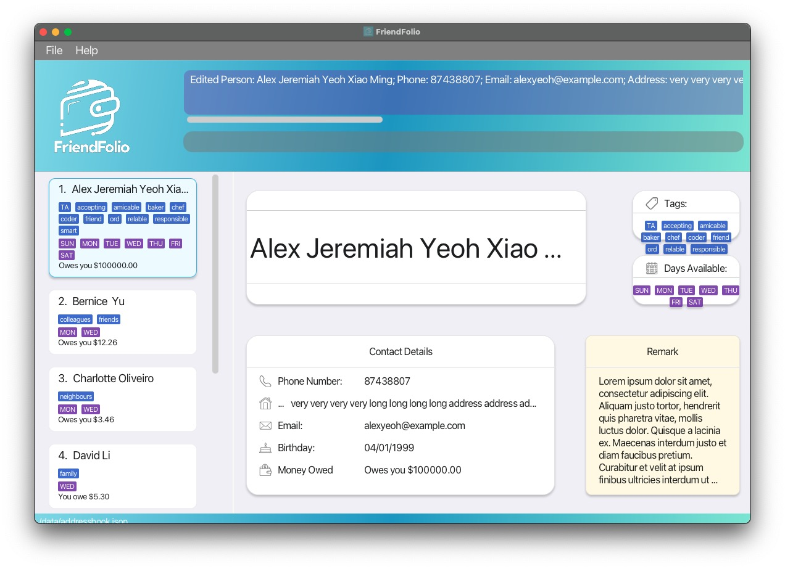

3. **Improved responsiveness of GUI for different screen sizes**

    We are aware that some UI components like the display card, overlap with other components when the screen
    size is reduced. We plan to enhance the responsiveness of our application to ensure it dynamically adapts and
    supports various display sizes seamlessly in the future.

    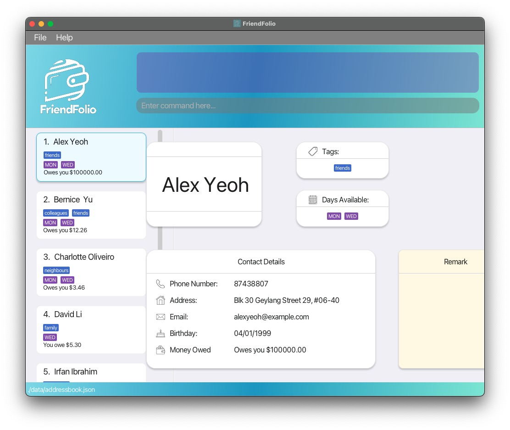

4. **Maintain information of GUI for different screen sizes**

    We are aware that when the screen size is reduced, some information from the contact details card may get cut off.
    We plan to address this issue by enhancing the responsiveness of our interface in future updates, ensuring that
    all information remains visible and accessible on smaller screens.

    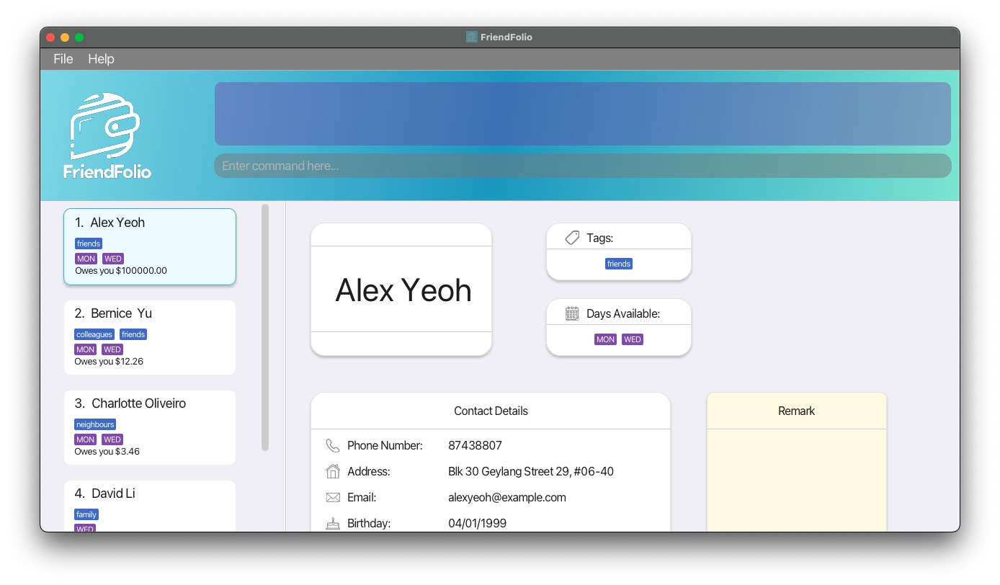

5. **Improve messages to user**

    We are aware that some of our error and success messages could be more informative for our users.
    For example, the current success message for edit and add command does not display information
    on birthday, money owed and days available. We plan to enhance these messages to provide more
    specific information, ensuring a better user experience.

6. **Use of symbols in names**

    Our application currently supports only alphanumeric characters in names and restricts the use of symbols
    such as `/`. However, we recognize that in many cultures, names might include components like `s/o` (son of).
    To better accommodate these conventions, we are considering expanding our character allowance to include
    certain symbols in future enhancements.

--------------------------------------------------------------------------------------------------------------------

## **Appendix: Instructions for manual testing**

Given below are instructions to test the app manually.

:information_source: **Note:** These instructions only provide a starting point for testers to work on;
testers are expected to do more *exploratory* testing.

### Launch and shutdown

1. Initial launch

    1. Download the jar file and copy into an empty folder

    1. Double-click the jar file Expected: Shows the GUI with a set of sample contacts. The window size may not be
       optimum.

1. Saving window preferences

    1. Resize the window to an optimum size. Move the window to a different location. Close the window.

    1. Re-launch the app by double-clicking the jar file. 
       Expected: The most recent window size and location is retained.

1. _{ more test cases …​ }_

### Deleting a person

1. Deleting a person while all persons are being shown

    1. Prerequisites: List all persons using the `list` command. Multiple persons in the list.

    1. Test case: `delete 1` 
       Expected: First contact is deleted from the list. Details of the deleted contact shown in the status message.
       Timestamp in the status bar is updated.

    1. Test case: `delete 0` 
       Expected: No person is deleted. Error details shown in the status message. Status bar remains the same.

    1. Other incorrect delete commands to try: `delete`, `delete x`, `...` (where x is larger than the list size) 
       Expected: Similar to previous.

1. _{ more test cases …​ }_

### Lending an amount to a person

1. Lending money to a person when all persons are being shown

   1. Prerequisites: List all persons using the `list` command. At least one person in the list with first contact
having $0 for money owed.
   
   1. Test case: `lend 1 $/50` 
      Expected: First contact in the list now owes you $50 more.
   
   1. Test case: `lend x $/50` (where x is larger than list size) 
      Expected: Amount owed of all contacts remain the same, error details show that index is invalid.
   
   1. Test case: `lend 1 $/100001` 
      Expected: Amount owed of first contact remains the same, error details shown in status message.

### Splitting an amount between user and a group

1. Splitting an amount between user and a group when all persons are being shown

    1. Prerequisites: List all persons using the `list` command. Multiple persons in the list with first and second
contact having $0 for money owed.

    1. Test case: `split 1 2 $/30` 
       Expected: First and second contact in the list now owe you $10 more.
   
    1. Test case: `split 1 2 $/-30` 
       Expected: Amount owed of first and second contacts remain the same, error details shown in status message.
   
    1. Test case: `split 1 2 $/100001` 
       Expected: Amount owed of first and second contacts remain the same, error details shown in status message.

### Adding remarks to a person

1. Adding remark to a person when all persons are being shown

    1. Prerequisites: List all persons using the `list` command. Multiple persons in the list.

    1. Test case: `remark 1 r/He likes to swim` 
       Expected: First contact now has remark `He likes to swim`.
   
    1. Test case: `remark 1 r/` 
       Expected: First contact now has empty remark.
   
    1. Test case: `remark x r/She likes to jog` (where x is larger than list size) 
       Expected: Remark of all contacts remain the same, error details shown in status message.

### Saving data

1. Dealing with missing/corrupted data files

    1. _{explain how to simulate a missing/corrupted file, and the expected behavior}_

1. _{ more test cases …​ }_
