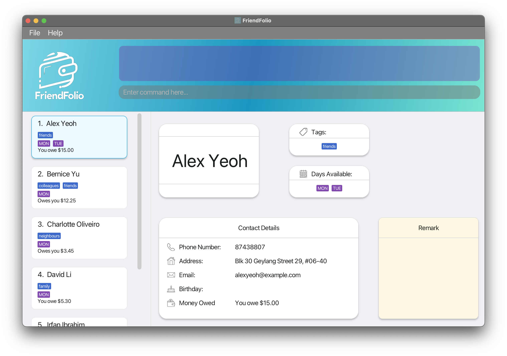

***Welcome to FriendFolio!***

Congratulations on joining the FriendFolio community! We're thrilled to have you on board. FriendFolio isn't just your
ordinary address book; it's your ultimate companion for staying organized, managing finances between friends, and
syncing up with your buddies' school schedules effortlessly.

This user guide is designed to help you navigate every feature of FriendFolio with ease, ensuring you make the most
out of your experience. So sit back, relax, and let's dive into the exciting world of FriendFolio!

Happy organizing,

The FriendFolio Dev Team

---
***Why This User Guide Matters***

While FriendFolio is designed to be intuitive and user-friendly, taking a few moments to familiarize yourself with this
guide will significantly enhance your overall experience. Here's why:

**Unlock Hidden Features**: Uncover useful FriendFolio features that go beyond your everyday address book app and
leverage FriendFolio to its full potential.

**Streamline Your Experience**: Find useful tips to streamline your FriendFolio experience and navigate the app
effortlessly, saving time and frustration.

**Maximize Efficiency**: Gain valuable insights and best practices to ensure FriendFolio maximizes efficiency in your
social interactions.

In essence, this user guide isn't just a manual – it's your key to unlocking the full potential of FriendFolio and
revolutionizing the way you connect with friends. So don't overlook its importance; dive in, explore, and elevate your
FriendFolio experience today!

---

***A Quick Overview***

FriendFolio is a **desktop CLI (Command Line Interface)-optimized app** with intuitive GUI (Graphical User Interface)
elements for managing contacts which can **track both your finances** and your **friends’ availabilities**, with a
singular focus of streamlining student life by simplifying tasks like splitting bills between friends, ensuring users
can effortlessly manage their finances and social engagements.

**Table of Contents:**

1. [Getting Started](#getting-started)
2. [Useful Features](#features)
    1. [User Interface Overview](#user-interface-overview)
    2. [Command Overview](#command-overview)
        1. [`Help` Command](#viewing-help-help)
        2. [`Add` Command](#adding-a-person-add)
        3. [`List` Command](#listing-all-persons-list)
        4. [`Edit` Command](#editing-a-person-edit)
        5. [`Delete` Command](#deleting-a-person-delete)
        6. [`Filter` Command](#filtering-based-on-selected-types--filter)
        7. [`Lend` Command](#lending-an-amount--lend)
        8. [`Split` Command](#splitting-an-amount-owed-split)
        9. [`Sort` Command](#sorting-contacts-sort)
        10. [`Pay` Command](#generating-payment-qr-code--pay)
        11. [`Clear` Command](#clearing-all-entries-clear)
        12. [`Remark` Command](#adding-or-editing-a-remark-remark)
        13. [`Exit` Command](#exiting-the-program-exit)
    4. [Saving Data Files](#saving-the-data)
    5. [Editing Data Files](#editing-the-data-file)
    6. Exporting Data (Coming soon)
3. [FAQs](#faq)
4. [Known Issues](#known-issues)
5. [Command Summary](#command-summary)

--------------------------------------------------------------------------------------------------------------------

## Getting Started

1. Ensure you have Java `11` or above installed in your Computer.
2. Download the latest `friendfolio.jar` from [here](https://github.com/AY2324S2-CS2103T-T16-2/tp/releases).
3. Copy the file to the folder you want to use as the _home folder_ for FriendFolio.
4. Open a command terminal, `cd` into the folder you put the jar file in, and use the `java -jar friendfolio.jar`
   command to run the application. 
   A GUI similar to the below should appear in a few seconds. Note how the app contains some sample data. 
   
5. Type the command in the command box and press Enter to execute it. e.g. typing **`help`** and pressing Enter will
   open the help window. 
   Some example commands you can try:

    * `list` : Lists all contacts.

    * `add n/John Doe p/98765432 e/johnd@example.com a/John street, block 123, #01-01` : Adds a contact named `John Doe`
      to the Address Book.

    * `delete 3` : Deletes the 3rd contact shown in the current list.

    * `clear` : Deletes all contacts.

    * `exit` : Exits the app.

6. Refer to the [Command Overview](#command-overview) below for details of each command.

--------------------------------------------------------------------------------------------------------------------

## Features

### User Interface Overview

When you launch FriendFolio, you will be greeted with some key information on the dashboard. Let's walk you through some
of the components in the dashboard!

**Dashboard:**

The dashboard gives you an overview of your day. Here are the components of the dashboard.

* The dashboard displays the current time so that you do not have to dart your eyes elsewhere to find out what time it
  currently is.
* FriendFolio tells you the number of contacts you have so that you have a sensing of how many contacts you have. The
  more, the merrier!
* There is a graph to show you how much you are owed, and how much you owe others. At one glance, you can find out if
  you need to transfer anyone money, or if you need to chase anyone for payment.
* FriendFolio tells you who is available today, so you know if your friends are free to meet you for a meal, or if they
  are free to discuss that one group project you all might have been procrastinating on.

**Command Line Interface:**

* At the top of the screen is the command line interface. You can type in commands into the command box and the command
  results will be displayed in the box above!

**Contact List:**

* On the left is where you can see your contacts. Clicking on these cards will replace the dashboard with more detailed
  information the contact that you clicked on. You can unselect the contact by pressing on the `Esc` key.
  

## Command Overview

**:information_source: Notes about the command format:** 

* Words in `UPPER_CASE` are the parameters to be supplied by the user. 
  e.g. in `add n/NAME`, `NAME` is a parameter which can be used as `add n/John Doe`.

* Items in square brackets are optional. 
  e.g. `n/NAME [t/TAG]` can be used as `n/John Doe t/friend` or as `n/John Doe`.

* Items with `…`​ after them can be used multiple times including zero times. 
  e.g. `[t/TAG]…​` can be used as ` ` (i.e. 0 times), `t/friend`, `t/friend t/family` etc.

* Items that start with `--` are flags that you can use to achieve slightly different outcomes than the default. 
  Any redundant text after the flag will be ignored.
  e.g. `--all`

* Parameters can be in any order. 
  e.g. if the command specifies `n/NAME p/PHONE_NUMBER`, `p/PHONE_NUMBER n/NAME` is also acceptable.

* Redundant text/parameters for commands that do not take in parameters (such as `help`, `list`, `exit` and `clear`)
  will be
  ignored. 
  e.g. if the command specifies `help 123`, it will be interpreted as `help`.

* If you are using a PDF version of this document, be careful when copying and pasting commands that span multiple lines
  as space characters surrounding line-breaks may be omitted when copied over to the application.

### Viewing help: `help`

Shows a message explaining how to access the help page.

Format: `help`

### Adding a person: `add`

Adds a person to the address book. Note that birthdays follow the following format: `dd/mm/yyyy`

Format: `add n/NAME p/PHONE_NUMBER e/EMAIL a/ADDRESS [b/BIRTHDAY] [$/MONEY_OWED] [t/TAG]… [d/DAY]…​`

***Names in FriendFolio***

* Names are unique in FriendFolio, therefore people with the same name must be differentiated either with extra
  characters or otherwise. For example, if "John Tan" exists in your contacts:
    * E.g: `add n/John Tan p/98765432 e/johnT@example.com a/John street, block 123, #01-01` fails.
    * E.g: `add n/John Tan from SoC p/98765432 e/johnT@example.com a/John street, block 123, #01-01` succeeds.
* Note that duplicate name detection is **case-sensitive**, therefore:
    * E.g: `add n/john tan p/98765432 e/johnT@example.com a/John street, block 123, #01-01` also succeeds.
* Names are alphanumeric only.
    * E.g: `add n/Hàn yǔ Pīn yīn p/98765432 e/hypy@example.com a/John street, block 123, #01-01` fails.

:bulb: **Tip:**
A person can have any number of tags (including 0)

* MONEY_OWED can have a MINIMUM of -100,000 and a MAXIMUM of 100,000.
* Maximum total amount you can owe or a person owes you is 100,000.

Examples:

* `add n/John Doe p/98765432 e/johnd@example.com a/John street, block 123, #01-01 b/15/02/1999`
* `add n/Betsy Crowe t/friend e/betsycrowe@example.com a/Newgate Prison p/1234567 t/criminal`
* `add n/Plain Jane t/friend e/plainjane@example.com a/Newgate Prison p/2345678 b/01/01/2001 d/monday $/100`

### Listing all persons: `list`

Shows a list of all persons in the address book.

Format: `list`

* You can use the `list` command after a `filter` or `sort` command to get back the original list of contacts.

### Editing a person: `edit`

Edits an existing person in the address book.

Format: `edit INDEX [n/NAME] [p/PHONE] [e/EMAIL] [a/ADDRESS] [t/TAG]… [b/BIRTHDAY] [$/MONEYOWED] [d/DAY]…​`

* Edits the person at the specified `INDEX`. The index refers to the index number shown in the displayed person list.
  The index **must be a positive integer** 1, 2, 3, …​
* At least one of the optional fields must be provided.
* Existing values will be updated to the input values.
* MONEY_OWED can have a MINIMUM of -100,000 and a MAXIMUM of 100,000.
* When editing tags, the existing tags of the person will be removed i.e. adding of tags is not cumulative.
* You can remove all the person’s tags by typing `t/` without
  specifying any tags after it.

Examples:

* `edit 1 p/91234567 e/johndoe@example.com` Edits the phone number and email address of the 1st person to be `91234567`
  and `johndoe@example.com` respectively.
* `edit 2 n/Betsy Crower t/` Edits the name of the 2nd person to be `Betsy Crower` and clears all existing tags.

### Deleting a person: `delete`

Deletes the specified person from the address book.

Format: `delete INDEX`

* Deletes the person at the specified `INDEX`.
* The index refers to the index number shown in the displayed person list.
* The index **must be a positive integer** 1, 2, 3, …​

Examples:

* `list` followed by `delete 2` deletes the 2nd person in the address book.
* `filter name Betsy` followed by `delete 1` deletes the 1st person in the results of the `find` command.

### Filtering based on selected types: `filter`

Filters out the contacts that contain any or all of the keywords.
You can choose to filter by day available, by name or by tags, and specify if the returned contacts should match any
or all of the keywords specified using the `--all` optional flag at the end of the command.

Format:

1. `filter tag TAG_NAME... [--all]`
2. `filter name PERSON_NAME... [--all]`
3. `filter day DAY... [--all]`

* **At least one** type `tag`, `name` or `day` needs to be used.
* If multiple `TAG_NAME`, `PERSON_NAME` or `DAY` is used, the default result
  returned will be all matching contacts to any of the keywords.
* If the `--all` flag is provided, only contacts that match all the keywords will be shown.
    * Note that any text provided after the flag will be ignored!

Examples:

* `filter tag friend` returns all the contacts that has the tag "friend" attached to them.
* `filter day wednesday friday` returns all the contacts that are available on Wednesday
  or Friday or both.
* `filter day monday tuesday --all` returns all the contacts that are available on both Monday and Tuesday.

### Lending an amount: `lend`

Lend an amount of money and accumulate it to current amount owed of a person
using the displayed index from the address book.

Format: `lend INDEX $/MONEY_OWED`

* Using positive MONEY_OWED means you are lending money to the person,
  while using negative MONEY_OWED means you are borrowing from the person.
* MONEY_OWED can have a MINIMUM of -100,000 and a MAXIMUM of 100,000.
* Amount you owe or amount the person owes you cannot exceed 100,000.
* The index refers to the index number shown in the displayed person list.
* The index **must be a positive integer** 1, 2, 3, …​

Examples:

* If the first person in the displayed list owes me $3 now,
    * `lend 1 $/2` &#8594; first person owes me $5 now
    * `lend 1 $/-1.50` &#8594; first person owes me $0.50 now

### Splitting an amount owed: `split`

Splits the sum of money owed among you and a group of person using the displayed
index from the address book, assuming you paid for a bill.

Format: `split INDEX [INDEX]... $/MONEY_OWED`

* MONEY_OWED should not be negative and have **at most 2 decimal places**.
* MONEY_OWED can have a MAXIMUM of 100,000 and the amount after splitting
  should be at least $0.01.
* Amount you owe or amount the person owes you after splitting cannot exceed 10000.
* There must be **at least 1 index**.
* The amount will be evenly distributed among you and the group of people with index mentioned
  and the split amount will be added on to their current amount of money owed.
* The index refers to the index number shown in the displayed person list.

Examples:

* `split 1 2 $/6.60` will split $6.60 evenly among you and two more people which is
  adding $2.20 to the amount owed of the person at index 1 and 2.

### Sorting contacts: `sort`

Sorts your contacts in one of three sorting methods:

1. Name (`name`)
2. Birthday (`birthday`)
3. Money Owed (`money`)
4. Default (`clear`)

Format: `sort SORT_METHOD`

* `SORT_METHOD` should be one of four keywords listed above.
* Sorting by name sorts contacts by alphabetical order.
* Sorting by birthday arranges contacts based on their closest birthdays, with those having upcoming birthdays appearing
  first. Contacts without saved birthday information are placed at the end of the sorted list.
* Sorting by money owed will prioritize contacts based on the amount owed, with those owed the most money appearing
  first, followed by those who owe you the most. Contacts with no money owed to or by them will be placed at the end of
  the list.
* The default sorting method lists your contacts in order of when you added them into FriendFolio.

### Generating payment QR code: `pay`

Generates a payment QR code for index selected from the displayed list.

Format: `pay INDEX`

* The index chosen should have a valid **Singaporean number** that is **registered for PayNow**.
* The index refers to the index number shown in the displayed person list.
* The index should be within the range of the displayed person list.
* After the QR code is displayed, you can scan it with your local banking application to pay the user. 
  If you owe them money, that amount will be put in as default, but you can change the amount you wish to pay in the banking application itself.

Examples:

* `pay 3` will generate a QR code for the third person in the displayed person list.

Potential errors:

* Invalid index.
* The person at the index does not have a valid Singaporean number.
* The person's number is not registered to PayNow.

### Clearing all entries: `clear`

Clears all entries from the address book.

Format: `clear`

### **Adding or Editing a Remark: `remark`**

Edits the remark of a person identified by the index number used in the last person listing. Any existing remark will be
overwritten by the input.

Format: `remark INDEX r/[REMARK]`

Parameters:

- `INDEX`: The index number shown in the displayed person list. Must be a positive integer.
- `r/[REMARK]`: The remark to add or edit for the person. If no remark is desired, leave this blank to remove any
  existing remarks.

Example:

- `remark 1 r/Likes to swim.` This command edits the remark of the first person in the list to "Likes to swim."

### Exiting the program: `exit`

Exits the program.

Format: `exit`

### Saving the data

AddressBook data are saved in the hard disk automatically after any command that changes the data. There is no need to
save manually.

### Editing the data file

AddressBook data are saved automatically as a JSON file `[JAR file location]/data/addressbook.json`. Advanced users are
welcome to update data directly by editing that data file.

:exclamation: **Caution:**
If your changes to the data file makes its format invalid, AddressBook will discard all data and start with an empty data file at the next run. Hence, it is recommended to take a backup of the file before editing it. 
Furthermore, certain edits can cause the AddressBook to behave in unexpected ways (e.g., if a value entered is outside the acceptable range). Therefore, edit the data file only if you are confident that you can update it correctly.

--------------------------------------------------------------------------------------------------------------------

## FAQ

**Q**: How do I transfer my data to another Computer? 
**A**: Install the app in the other computer and overwrite the empty data file it creates with the file that contains
the data of your previous AddressBook home folder.

--------------------------------------------------------------------------------------------------------------------

## Coming Soon in v2.0

***Making Phone Number and Email Address Unique***

Affects `add`, `edit`

FriendFolio is looking to make the person's phone number and email the unique identifiers in the future. 
This change aims to prevent multiple individuals from sharing the same email or phone number within the system 
while allowing multiple individuals with the same name to exist.

--------------------------------------------------------------------------------------------------------------------

## Known issues

1. **When using multiple screens**, if you move the application to a secondary screen, and later switch to using only
   the primary screen, the GUI will open off-screen. The remedy is to delete the `preferences.json` file created by the
   application before running the application again.

--------------------------------------------------------------------------------------------------------------------

## Command summary

| Action     | Format, Examples                                                                                                                                                                                                                       |
|------------|----------------------------------------------------------------------------------------------------------------------------------------------------------------------------------------------------------------------------------------|
| **Add**    | `add n/NAME p/PHONE_NUMBER e/EMAIL a/ADDRESS [b/BIRTHDAY] [$/MONEY_OWED] [t/TAG]… [d/DAY]…​`   e.g., `add n/James Ho p/22224444 e/jamesho@example.com a/123, Clementi Rd, 1234665 t/friend t/colleague b/01/01/2001 d/monday $/100` |
| **Clear**  | `clear`                                                                                                                                                                                                                                |
| **Delete** | `delete INDEX`  e.g., `delete 3`                                                                                                                                                                                                    |
| **Edit**   | `edit INDEX [n/NAME] [p/PHONE_NUMBER] [e/EMAIL] [a/ADDRESS] [$/MONEY_OWED] [b/BIRTHDAY] [t/TAG]… [d/DAY]…​`  e.g.,`edit 2 n/James Lee e/jameslee@example.com`                                                                       |
| **Exit**   | `exit`                                                                                                                                                                                                                                 |
| **Filter** | `filter TYPE KEYWORD [--all]`  e.g., `filter day wednesday friday --all`, `filter tag family`                                                                                                                                       |
| **Help**   | `help`                                                                                                                                                                                                                                 |
| **Lend**   | `lend INDEX $/MONEY_OWED`  e.g., `lend 1 $/2.50`, `lend 2 $-1.65`                                                                                                                                                                   |
| **List**   | `list`                                                                                                                                                                                                                                 |
| **Pay**    | `pay INDEX`  e.g., `pay 3`                                                                                                                                                                                                          |
| **Sort**   | `sort SORT_METHOD`  e.g., `sort birthday`                                                                                                                                                                                           |
| **Split**  | `split INDEX [INDEX]… $/MONEY_OWED`   e.g., `split 1 2 $/20.10`                                                                                                                                                                     |
| **Remark** | `remark INDEX r/[REMARK]`   e.g., `remark 1 r/Likes to swim.`                                                                                                                                                                       |
