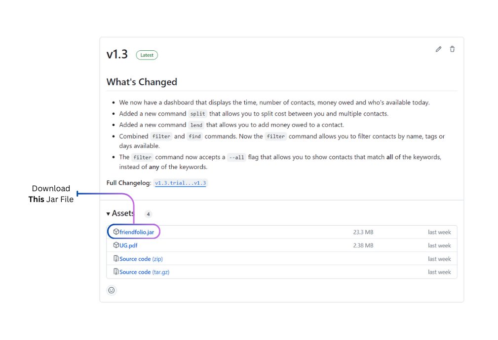
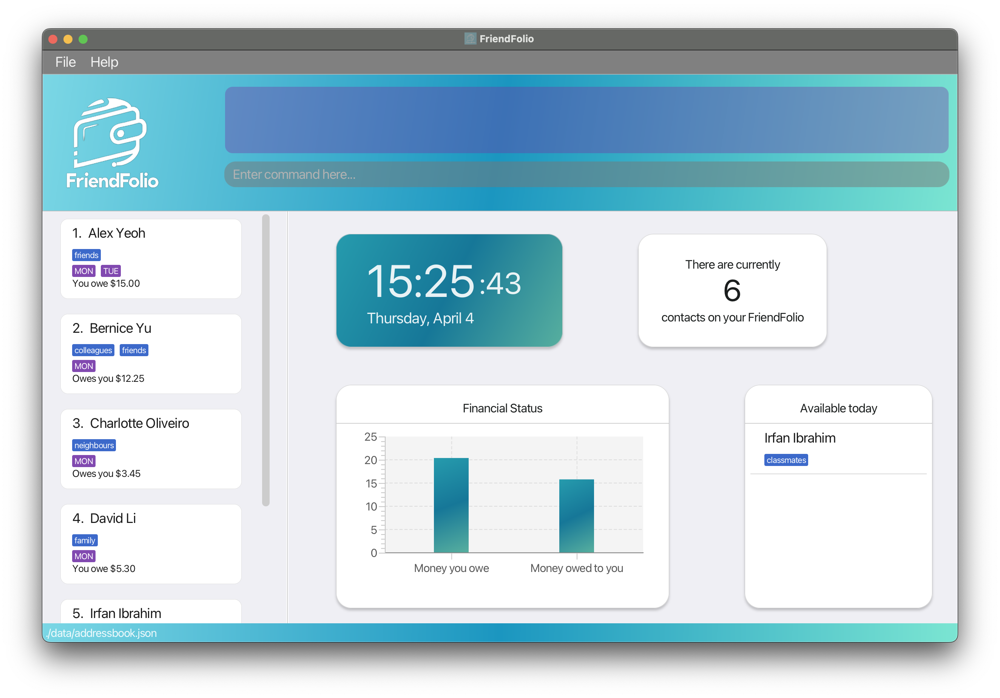
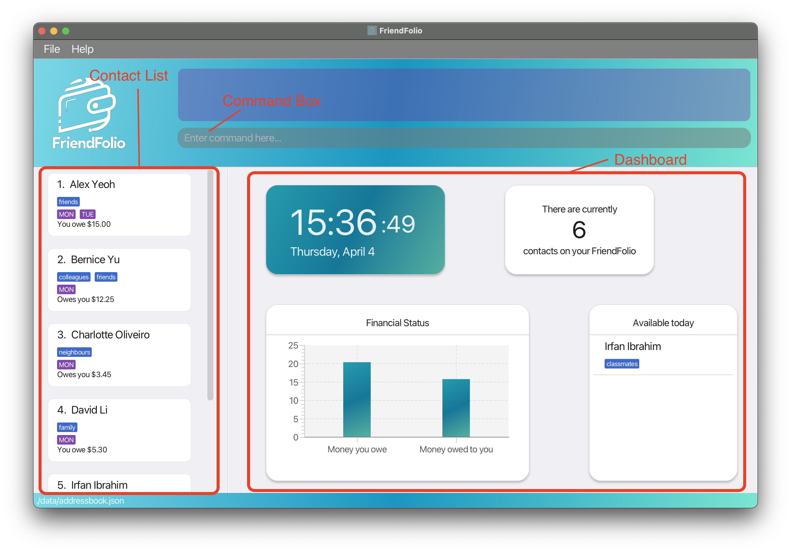
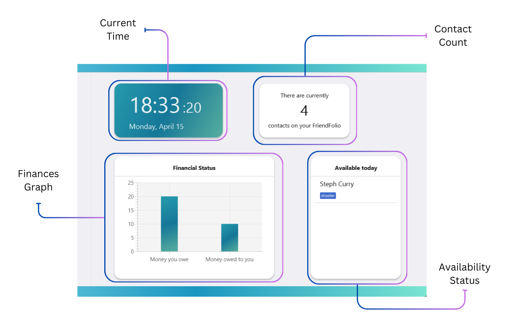
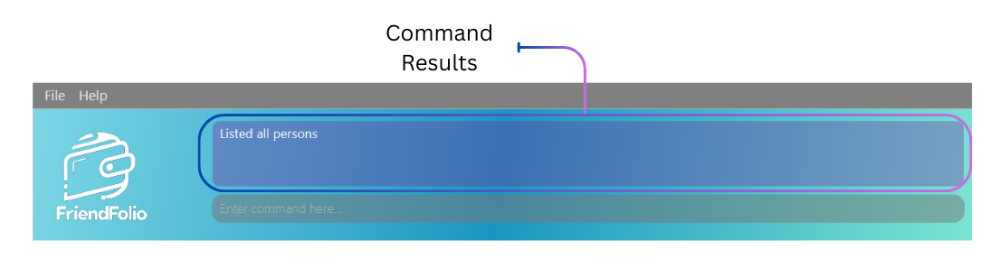
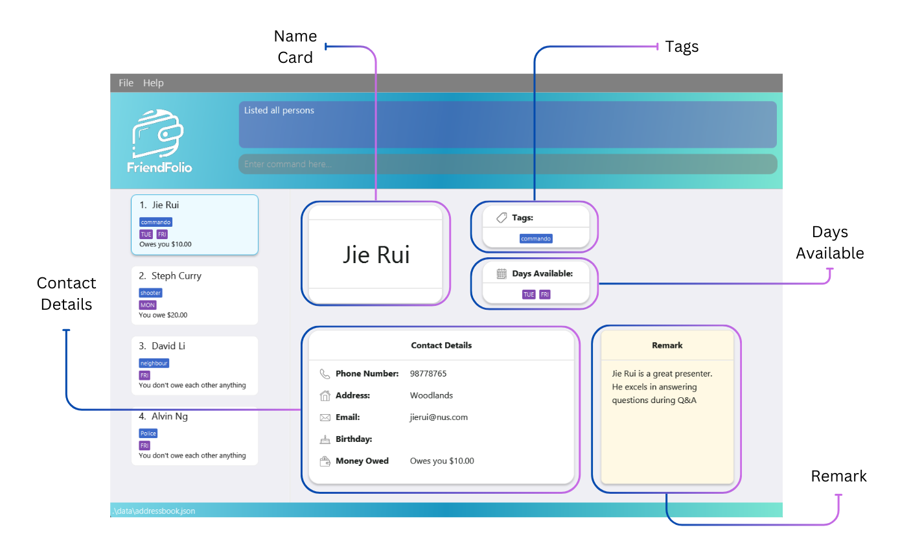

***Welcome to FriendFolio!***

Congratulations on joining the FriendFolio community! We're thrilled to have you on board. FriendFolio isn't just your
ordinary address book; it's your ultimate companion for staying organized, managing finances between friends, and
syncing up with your buddies' school schedules effortlessly.

This user guide is designed to help you navigate every feature of FriendFolio with ease, ensuring you make the most
out of your experience. So sit back, relax, and let's dive into the exciting world of FriendFolio!

Happy organizing,

The FriendFolio Dev Team

***A Quick Overview***

FriendFolio is your ultimate companion for simplifying student life! Whether you're **managing your contacts**,
**splitting bills with friends**, or **syncing up with your buddies' schedules**, FriendFolio has got you covered.
It seamlessly combines desktop CLI (Command Line Interface) functionality with intuitive GUI (Graphical User Interface)
elements. So dive in and let FriendFolio revolutionize the way you navigate your social and financial interactions!

### Table of Contents

1. [Introduction](#1-introduction)
    - 1.1 [What is FriendFolio?](#11-what-is-friendfolio)
    - 1.1 [Why This User Guide Matters](#12-why-this-user-guide-matters)
    - 1.2 [Who This User Guide Is For](#13-who-this-user-guide-is-for)
3. [How To Use This Guide](#2-how-to-use-this-guide)
    - 2.1 [Navigating This Guide](#21-navigating-this-guide)
    - 2.2 [Special Icons](#22-special-icons)
4. [Getting Started](#3-getting-started)
    - 3.1 [Installation](#31-installation)
    - 3.2 [Starting Up](#32-starting-up)
5. [User Interface Overview](#4-user-interface-overview)
    - 4.1 [Dashboard](#41-dashboard)
    - 4.2 [Command Box](#42-command-box)
    - 4.3 [Contact List](#43-contact-list)
6. [Command Overview](#5-command-overview)
    - 5.1 [Parameter Prefixes](#51-parameter-prefixes)
    - 5.2 [Data Modification Commands](#52-data-modification-commands)
        - [`Add` Command](#adding-a-person-add)
        - [`Edit` Command](#editing-a-person-edit)
        - [`Delete` Command](#deleting-a-person-delete)
        - [`Clear` Command](#clearing-all-entries-clear)
        - [`Remark` Command](#adding-or-editing-a-remark-remark)
    - 5.3 [Financial Transactions Commands](#53-financial-transactions-commands)
        - [`Lend` Command](#lending-an-amount-lend)
        - [`Split` Command](#splitting-an-amount-owed-split)
        - [`Pay` Command](#generating-payment-qr-code-pay)
    - 5.4 [Data Organization Commands](#54-data-organization-commands)
        - [`List` Command](#listing-all-persons-list)
        - [`Filter` Command](#filtering-based-on-selected-types-filter)
        - [`Sort` Command](#sorting-contacts-sort)
    - 5.5 [Utility Commands](#55-utility-commands)
        - [`Help` Command](#viewing-help-help)
        - [`Exit` Command](#exiting-the-program-exit)
7. [Handling Data](#6-handling-data)
    - 6.1 [Saving Data Files](#61-saving-the-data)
    - 6.2 [Editing Data Files](#62-editing-the-data-file)
8. [FAQs](#7-faq)
9. [Coming Soon](#8-coming-soon-in-v20)
    - 8.1 [Unique Phone Numbers and Emails](#81-unique-phone-numbers-and-emails)
    - 8.2 [Improved Responsiveness of GUI](#82-improved-responsiveness-of-gui)
10. [Known Issues](#9-known-issues)
11. [Command Summary](#10-command-summary)

## 1. Introduction

[:arrow_heading_up:](#table-of-contents)

### 1.1. What is FriendFolio?

Welcome to FriendFolio, your new digital buddy that's all about simplifying your social life! Imagine having a personal
assistant dedicated to keeping your contacts, social plans, and shared expenses neatly organized - that's FriendFolio
for you!

FriendFolio isn't just another contact app. It’s a vibrant hub where you can:

- **Store and Update Contact Information:** Keep your friends close, but their contact details closer! FriendFolio
  allows you to effortlessly manage your contacts' information, making sure you're just a click away from connecting.

- **Split Bills Without the Spills:** Whether you’re dining out or sharing a gift, FriendFolio’s bill-splitting feature
  ensures that everyone chips in fairly, so you can focus on the fun, not the finances.

- **Sync Schedules Like a Pro:** Check who's available and when, so you can plan gatherings or group studies without
  the back-and-forth. FriendFolio keeps everyone's schedules in check, ensuring you never miss a beat.

- **Track Debts with Ease:** Owing and being owed has never been clearer. FriendFolio keeps a neat record of all
  financial exchanges among friends, making those awkward money conversations a thing of the past.

- **Navigate with Nimble Commands:** With its intuitive Command Line Interface (CLI), power users can zip through tasks
  with quick commands.

- **Personalize with Remarks:** Add a personal touch to your contacts with custom remarks, making each entry as unique
  as the friend it represents.

FriendFolio is more than just an app; it's a way to enhance connections, streamline social logistics, and make every
interaction with your friends a little easier and a lot more enjoyable. So go ahead, dive in, and see how FriendFolio can transform your everyday social chaos into organized harmony!

[:arrow_heading_up:](#table-of-contents)

### 1.2. Why This User Guide Matters

While FriendFolio is designed to be intuitive and user-friendly, taking a few moments to familiarize yourself with this
guide will significantly enhance your overall experience. Here's why:

- **Unlock Hidden Features**: Uncover useful FriendFolio features that go beyond your everyday address book app
  and leverage FriendFolio to its full potential.

- **Streamline Your Experience**: Find useful tips to streamline your FriendFolio experience and navigate the app
  effortlessly, saving time and frustration.

- **Maximize Efficiency**: Gain valuable insights and best practices to ensure FriendFolio
  maximizes efficiency in your social interactions.

In essence, this user guide isn't just a manual – it's your key to unlocking the full potential of FriendFolio and
revolutionizing the way you connect with friends. So don't overlook its importance; dive in, explore, and elevate your
FriendFolio experience today!

[:arrow_heading_up:](#table-of-contents)

### 1.3. Who This User Guide is For

FriendFolio is designed with the needs of college students and young professionals in mind. It is ideal for those who
manage their academic and social lives digitally, dealing with tasks like bill splitting, schedule syncing, and contact
management through a desktop interface.

#### Assumptions

We assume that users of this guide:

- Are familiar with basic computer operations such as clicking, typing, and navigating through software interfaces.
- Have a general understanding of how to install applications and open files on their computers.
- Do not need detailed explanations of common tech terminology but can benefit from a glossary of application-specific
  terms which is provided at the end of this guide.

This guide will help you navigate FriendFolio from basic setup to advanced features, ensuring that you make the most
out of your experience!

[:arrow_heading_up:](#table-of-contents)

## 2. How to Use This Guide

Navigating our user guide efficiently is key to leveraging FriendFolio's full potential quickly! This section will help
you understand how to best use this guide and interpret the icons and formatting used throughout.

[:arrow_heading_up:](#table-of-contents)

### 2.1. Navigating This Guide

This user guide is structured to help you find information quickly and easily. Here’s how you can navigate through the
guide:

- **Table of Contents:** At the beginning of the guide, the [Table of Contents](#table-of-contents) provides a
  clickable index of the major sections and sub-sections. Use this as your starting point to jump directly to the parts
  of the guide that are most relevant to your needs!

- **Section Headers:** Each major section and sub-section of the guide is clearly labeled with descriptive headers.
  As you scroll through the user guide, these headers will help you quickly identify the content of each
  section with ease.

- **Return to Table of Contents Button:**  At the bottom right of each section, you'll find a
  [:arrow_heading_up:](#table-of-contents) icon. Clicking this takes you straight back to the
  [Table of Contents](#table-of-contents), allowing for quick navigation without scrolling.

[:arrow_heading_up:](#table-of-contents)

### 2.2. Special Icons

To enhance your understanding and highlight key information, we use three types of special icons throughout this guide:

:bulb: **Tip**: This light bulb icon is used to draw attention to helpful hints and shortcuts. Tips are designed to
improve your use of FriendFolio by providing additional context or simpler methods to perform tasks.

:information_source: **Information**: Whenever you see this information icon, it indicates supplementary details that
provide deeper insights or background information. This could include explanations of complex features, definitions of
terms, or extended usage guidelines.

:warning: **Warning**: The warning icon highlights important actions or steps that require your careful attention to
ensure correct usage of FriendFolio. These warnings help you avoid common pitfalls that could disrupt your workflow.

:exclamation: **Caution**: This icon is used to signal critical information regarding potential risks such as data loss
or configuration issues that could impact your experience. It is crucial to follow these guidelines to prevent data
integrity problems.

[:arrow_heading_up:](#table-of-contents)

## 3. Getting Started

Welcome to the beginning of your FriendFolio journey! This section walks you through the initial setup steps, from
checking your system's compatibility to launching the application. Follow these straightforward instructions to start
managing your contacts and schedules with ease in no time.

[:arrow_heading_up:](#table-of-contents)

### 3.1. Installation

1. **Check Your Java Version:** Make sure you have Java `11` or above installed on your computer. You may download Java 11 [here](https://www.oracle.com/java/technologies/downloads/#java11).
2. **Download FriendFolio:** Head over to [this link](https://github.com/AY2324S2-CS2103T-T16-2/tp/releases) and grab the latest `friendfolio.jar` file.

   

3. **Set Up Your Home Folder:** Copy the downloaded file to the folder you want to use as your _home folder_ for FriendFolio.

[:arrow_heading_up:](#table-of-contents)

### 3.2. Starting Up

1. **Run the application:**
    1. Open a command terminal (e.g. _Terminal_ on MacOS or _Powershell_ on Windows)
    2. Navigate to the folder containing `friendfolio.jar` using the `cd` command. (e.g. if your `friendfolio.jar` is in `C:/Downloads`, run `cd C:/Downloads`)
    3. Use the command `java -jar friendfolio.jar` to launch the application.
    4. A GUI similar to the below should appear in a few seconds. Note how the app contains some sample data.
       
2. **Start exploring:** Type commands into the command box and hit Enter to execute them. For example, try typing `help` to open the help window. Here are a few other commands you can try out:
    * `list` : Lists all contacts.
    * `add n/John Doe p/98765432 e/johnd@example.com a/John street, block 123, #01-01` : Adds a contact named `John Doe`
      to the Address Book.
    * `delete 3` : Deletes the 3rd contact shown in the current list.
    * `clear` : Deletes all contacts.
    * `exit` : Exits the app.
3. **Command Overview:** Need more details on each command? Check out the [Command Overview](#5-command-overview) below.

[:arrow_heading_up:](#table-of-contents)

## 4. User Interface Overview

When you launch FriendFolio, you will be greeted with some key information on the dashboard. Let's take a tour of what you'll find when you launch the app.

[:arrow_heading_up:](#table-of-contents)

### 4.1. Dashboard

Get ready for a quick glance at your day! Here's what you'll find on the dashboard:

* **Current Time:** Stay on track with the current time displayed right here, so you don't have to look away.
* **Contact Count:** See how many buddies you've got in your network because the more, the merrier!
* **Finances Graph:** Keep tabs on who owes you and who you owe, all in one neat graph. No more guesswork on who needs a gentle reminder about that borrowed cash.
* **Availability Status:** Know at a glance who's free today, perfect for planning catch-ups or tackling group projects together.

[:arrow_heading_up:](#table-of-contents)

### 4.2. Command Box

Right at the top of the screen, you'll find the trusty command box, your gateway to managing FriendFolio.
Just type in your commands here, hit Enter, and watch as the results appear right above the box. It's that simple!

[:arrow_heading_up:](#table-of-contents)

### 4.3. Contact List

On the left is where you can see your contacts. Each contact card is a snapshot of essential details, offering a
peek at your friend's availability and how your balances stand.

Want to know more? Simply click on a contact card to
reveal in-depth information, including:

- **Tags:** Quick labels for categorizing your contacts, such as 'commando' for your gym buddies or 'study' for project
  group members.
- **Days Available:** A glance at when your friend is free, like 'TUE' for Tuesdays, so you can plan get-togethers or
  study sessions with ease.
- **Contact Details:** Dive deeper with a click and see phone numbers, addresses, email, birthday information, and even
  the balance of money owed.
- **Remark:** Personal notes you've added, like 'great presenter' or unique traits, to remember the little things that
  make each friendship special.

And when you need to return to the main dashboard, a simple tap of the `'Esc'` key whisks you back. FriendFolio's
Contact List is your personal directory, making social and financial coordination a breeze.

[:arrow_heading_up:](#table-of-contents)

## 5. Command Overview

**:warning: Using the PDF version of this guide?**

If you're _copying and pasting_ commands that **span multiple lines** from the PDF, be aware that space characters surrounding line breaks may be omitted when pasted into the application. Keep an eye out for any missing spaces to ensure your commands work smoothly!

**:information_source: Notes about the command format:** 

* Words in `UPPER_CASE` are the parameters to be supplied by the user. 
  e.g. in `add n/NAME`, `NAME` is a parameter which can be used as `add n/John Doe`.

* Items in square brackets are optional. 
  e.g. `n/NAME [t/TAG]` can be used with or without a tag, like `n/John Doe t/friend` or simply `n/John Doe`.

* Items with `…` after them can be used multiple times. 
  e.g. `[t/TAG]…` can be completely omitted, inlcuded once as `t/friend`, or multiple times like `t/friend t/family`. 
  e.g. `INDICES…` represent a parameter that has to be used at least once because of the absence of square brackets.

* Items that start with `--` are flags that alter the command's default behavior. 
  Any redundant text after the flag will be ignored. 
  e.g. `--all`

* Parameters can be in any order. 
  e.g. if the command specifies `n/NAME p/PHONE_NUMBER`, `p/PHONE_NUMBER n/NAME` is also acceptable.

* Redundant text/parameters for commands that do not take in parameters (such as `help`, `list`, `exit` and `clear`) will be ignored. 
  e.g. if the command specifies `help 123`, it will be interpreted as `help`.

[:arrow_heading_up:](#table-of-contents)

### 5.1. Parameter Prefixes

Navigating FriendFolio is simple once you master the parameter prefixes! These shortcuts help you communicate
effectively with the system by specifying the data needed for each command.

Below is a table of the all the prefixes you'll use. Whether you’re adding new contacts or updating existing ones,
these will ensure smooth interactions with FriendFolio.

| Prefix | Parameter Description |
|--------|-----------------------|
| `n/`   | Name of the person    |
| `p/`   | Phone number          |
| `e/`   | Email address         |
| `a/`   | Physical address      |
| `b/`   | Birthday (dd/mm/yyyy) |
| `$/`   | Money owed or owing   |
| `t/`   | Tags for categorization (multiple allowed) |
| `d/`   | Days available (multiple allowed)           |
| `r/`   | Remark or note associated with the contact  |

[:arrow_heading_up:](#table-of-contents)

### 5.2. Data Modification Commands

These commands are your go-to tools for tailoring your address book to fit your needs. Whether you're adding new
friends, updating details for your current connections, or tidying up your contacts list, these features have you
covered.

[:arrow_heading_up:](#table-of-contents)

#### **Adding a person: `add`**

Ready to expand your address book? Let's add someone new!

Format: `add n/NAME p/PHONE_NUMBER e/EMAIL a/ADDRESS [b/BIRTHDAY] [$/MONEY_OWED] [t/TAG]… [d/DAY]…​`

:information_source: **Names in FriendFolio**

* Names are unique in FriendFolio, therefore people with the same name must be differentiated either with extra
  characters or otherwise. For example, if "John Tan" exists in your contacts:
    * E.g: `add n/John Tan p/98765432 e/johnT@example.com a/John street, block 123, #01-01` fails.
    * E.g: `add n/John Tan from SoC p/98765432 e/johnT@example.com a/John street, block 123, #01-01` succeeds.
* Note that duplicate name detection is **case-sensitive**, therefore:
    * E.g: `add n/john tan p/98765432 e/johnT@example.com a/John street, block 123, #01-01` also succeeds.

**:information_source: Attribute constraints:**

* Names are **alphanumeric** and can contain spaces.
* Phone numbers have to be **numeric** and at least 3 digits long.
* Addresses have to start with a **non-whitespace** character.
* Birthdays follow the following format: `dd/mm/yyyy`.
* Money owed ranges from -100,000 to 100,000 and has to be a **numeric** input with at most **2** decimal places. This means that maximum total amount you can owe or a person owes you is $100,000.
* Emails are a little tricky, but in short, a valid email is in the format `local-part@domain`, where:
    * The local-part contains only **alphanumeric** characters and any number of these special characters: `+_.-`, but may not start or end with them.
    * The domain consists of one or more labels separated by `.`, e.g. `gmail.com`.
    * Don't worry, as long as the email you enter follows the conventional email format, you're good to go!
* Tags have to be **alphanumeric**.

:bulb: **Tip:**
A person can have any number of tags or days available (including 0)

Examples:

* `add n/John Doe p/98765432 e/johnd@example.com a/John street, block 123, #01-01 b/15/02/1999`
* `add n/Betsy Crowe t/friend e/betsycrowe@example.com a/Newgate Prison p/1234567 t/criminal`
* `add n/Plain Jane t/friend e/plainjane@example.com a/Newgate Prison p/2345678 b/01/01/2001 d/monday $/100`

[:arrow_heading_up:](#table-of-contents)

#### **Editing a person: `edit`**

Time for some updates! Let's tweak an existing entry in your address book.

Format: `edit INDEX [n/NAME] [p/PHONE] [e/EMAIL] [a/ADDRESS] [t/TAG]… [b/BIRTHDAY] [$/MONEY_OWED] [d/DAY]…​`

* Edits the person at the specified `INDEX`. The index refers to the index number shown in the contact list on the left. 
  Make sure it's a **positive integer** (e.g. 1, 2, 3, …)
* At least one of the optional fields must be provided.
* Existing values will be overwritten by the input values.
* When editing tags, the existing tags of the person will be removed i.e. adding of tags is not cumulative.

:question: Need a refresher on the constraints for some of these fields? Refer to the attribute constraints [here](#attribute-constraints)!

:bulb: **Tip:** You can remove all the person’s tags by typing `t/` without specifying any tags after it.

:bulb: **Tip:** You can use the `filter` command and then the `edit` command. The index you provide will be based on the filter result. This applies to any command that takes in an index.

Examples:

* `edit 1 p/91234567 e/johndoe@example.com` Edits the phone number and email address of the 1st person to be `91234567`
  and `johndoe@example.com` respectively.
* `edit 2 n/Betsy Crower t/` Edits the name of the 2nd person to be `Betsy Crower` and clears all existing tags.

[:arrow_heading_up:](#table-of-contents)

#### **Deleting a person: `delete`**

Time to trim the roster! Let's remove someone from your address book.

Format: `delete INDEX`

* Deletes the person at the specified `INDEX`.
* The index refers to the index number shown in the contact list on the left.
* Make sure it's a **positive integer** (e.g. 1, 2, 3, …)

Examples:

* `list` followed by `delete 2` deletes the 2nd person in the address book.
* `filter name Betsy` followed by `delete 1` deletes the 1st person in the results of the `find` command.

[:arrow_heading_up:](#table-of-contents)

#### **Clearing all entries: `clear`**

Ready to start fresh? Use the `clear` command to wipe out all entries from your address book.

Format: `clear`

[:arrow_heading_up:](#table-of-contents)

#### **Adding or Editing a Remark: `remark`**

Let's add a personal touch! Use the `remark` command to add or edit remarks for your contacts.

Format: `remark INDEX r/[REMARK]`

Parameters:

- `INDEX`: The index number shown in the contact list. Must be a positive integer.
- `r/[REMARK]`: The remark to add or edit for the person. Leave this blank to remove any existing remarks.

Example:

- `remark 1 r/Likes to swim.` This command replaces the remark of the first person in the contact list with "Likes to swim".

[:arrow_heading_up:](#table-of-contents)

### 5.3. Financial Transactions Commands

Navigate your shared finances with ease using these commands. Whether you're sorting out who owes what after a group
dinner or planning expenses for a project, these tools make money matters straightforward and stress-free.

[:arrow_heading_up:](#table-of-contents)

#### **Lending an amount: `lend`**

Ready to lend a hand (or some cash)? Use the lend command to manage money transactions with your contacts.

Format: `lend INDEX $/MONEY_OWED`

* Use **positive** `MONEY_OWED` to lend money to the person, and **negative** `MONEY_OWED` to borrow from them.
* `MONEY_OWED` ranges from -100,000 to 100,000.
* The index refers to the number shown in the contact list. Ensure it's a **positive integer** (e.g., 1, 2, 3).

Examples:

* If the **first two** people in the contact list owe you $3 now,
    * `lend 1 $/2` &#8594; first person owes you $5 now
    * `lend 2 $/-1.50` &#8594; second person owes you $0.50 now

[:arrow_heading_up:](#table-of-contents)

#### **Splitting an amount owed: `split`**

Time to divide and conquer! Use the split command to evenly distribute a sum of money owed among yourself and a group of people.

Format: `split INDICES… $/MONEY_OWED`

* MONEY_OWED be a positive number at most 100,000 and have **at most 2 decimal places**.
* The amount will be evenly distributed among you and the group of people with index mentioned and the split amount will be added on to their current amount of money owed.
* The amount the person owes you after splitting cannot exceed 100,000.
* The amount after splitting should be at least 0.01.
* There must be **at least 1** index.
* The index refers to the index number shown in the contact list.

Examples:

* `split 1 2 $/6.60` evenly divides $6.60 among you and two other people, adding $2.20 to the amount owed by the first and second people in your contact list.

[:arrow_heading_up:](#table-of-contents)

#### **Generating payment QR code: `pay`**

Ready to make payments a breeze? Use the pay command to generate a QR code for quick transactions.

Format: `pay INDEX`

* The person at that index should have a valid **Singaporean number** that is **registered with PayNow**.
* The index refers to the index number shown in the contact list.

Examples:

* `pay 3` will generate a PayNow QR code for the third person in the contact list.

##### QR Code Window

* After the QR code is displayed, you can scan it with your local banking application to pay the user. If you owe them money, that amount will be set as the default payment, but you can adjust the amount within your banking application.
* If you owe the person money, you can click on the **Clear Debt** button to reset your money owed to $0 and close this window.
* Otherwise, click on the **Close Window** button to exit.

:warning: **Potential errors:**

* Invalid index.
* The person at the index does not have a valid Singaporean number.
* The person's number is not registered to PayNow.

[:arrow_heading_up:](#table-of-contents)

### 5.4. Data Organization Commands

These commands help you organize and retrieve contact information quickly, ensuring you always find what you need when
you need it.

[:arrow_heading_up:](#table-of-contents)

#### **Listing all persons: `list`**

Want to see everyone who is in your address book? Just type `list` to get a full rundown!

Format: `list`

**:bulb: Tip:** You can use the `list` command after a [`filter`](#filtering-based-on-selected-types-filter) command to get back the original list of contacts.

[:arrow_heading_up:](#table-of-contents)

#### **Filtering based on selected types: `filter`**

Let's narrow down your search! Use the filter command to refine your contact list based on specific criteria.
You can choose to filter by day available, by name or by tags, and specify if the returned contacts should match any
or all of the keywords specified using the `--all` optional flag at the end of the command.

Format:

1. `filter tag TAG_NAME… [--all]` OR
2. `filter name PERSON_NAME… [--all]` OR
3. `filter day DAY… [--all]`

* **At least one** of the types (`tag`, `name`, or `day`) needs to be used.
* If multiple `TAG_NAME`, `PERSON_NAME` or `DAY` is used, the default result
  returned will be all matching contacts to any of the keywords.
* Adding the --all flag ensures only contacts matching all the keywords are shown. Any text after the flag will be ignored!

Examples:

* `filter tag friend` returns contacts that has the tag "friend" attached to them.
* `filter day wednesday friday` returns contacts available on Wednesday, Friday, or both.
* `filter day monday tuesday --all` returns all contacts available on **both** Monday and Tuesday.

:bulb: **Tip:**
Use the `list` command after a `filter` command to reset any filters and display all contacts! This will not affect the current order of contacts, if you have used the [`sort`](#sorting-contacts-sort) command.

[:arrow_heading_up:](#table-of-contents)

#### **Sorting contacts: `sort`**

Time to tidy things up! Use the sort command to organize your contacts in a way that suits you best.

Format: `sort SORT_METHOD`

`SORT_METHOD` should be one of the following keywords:

1. `name`: Sorts contacts alphabetically by name.
2. `birthday`: Arranges contacts based on upcoming birthdays, with those closest to today appearing first.
3. `money`: Prioritizes contacts based on the amount owed, with those owed the most money appearing first, followed by those who owe you the most.
4. `clear`: Resets the sorting method to the default, listing contacts in the order they were added to FriendFolio.

:bulb: **Tip:**
Feel free to use the [`filter`](#filtering-based-on-selected-types-filter) command together with this command to filter our your contacts and show them in whichever order you please!

[:arrow_heading_up:](#table-of-contents)

### 5.5. Utility Commands

Essential tools that enhance your interaction with FriendFolio, providing support and easy navigation.

[:arrow_heading_up:](#table-of-contents)

#### **Viewing help: `help`**

Need a hand? Just type `help` to access the help page and get the guidance you need!

Format: `help`

[:arrow_heading_up:](#table-of-contents)

#### **Exiting the program: `exit`**

Ready to sign off? Just use the `exit` command to close the program.

Format: `exit`

[:arrow_heading_up:](#table-of-contents)

## 6. Handling Data

Efficiently managing and safeguarding your data is crucial to getting the most out of FriendFolio. This section guides
you through the essential processes of saving and editing your data securely.

[:arrow_heading_up:](#table-of-contents)

### 6.1. Saving the data

Your FriendFolio data is automatically saved to the hard disk after any command that alters the data. No manual saving required!

[:arrow_heading_up:](#table-of-contents)

### 6.2. Editing the data file

FriendFolio automatically saves your data as a JSON file located at `[JAR file location]/data/addressbook.json`. Advanced users can directly edit this data file if needed.

:exclamation: **Caution:**
If your changes to the data file makes its format invalid, FriendFolio will discard all data and start with an empty data file at the next run. Hence, it is recommended to take a backup of the file before editing it. 
Furthermore, certain edits can cause the FriendFolio to behave in unexpected ways (e.g., if a value entered is outside the acceptable range). Therefore, edit the data file only if you are confident that you can update it correctly.

[:arrow_heading_up:](#table-of-contents)

## 7. FAQ

**Q**: How do I transfer my data to another Computer? 
**A**: Install the app in the other computer and overwrite the empty data file it creates with the file that contains
the data of your previous FriendFolio home folder.

[:arrow_heading_up:](#table-of-contents)

## 8. Coming Soon in v2.0

Gear up for an even smoother and more personalized FriendFolio experience with our upcoming version 2.0. We're
fine-tuning the details to make sure your FriendFolio journey is as unique as your friendships.

[:arrow_heading_up:](#table-of-contents)

### 8.1. Unique Phone Numbers and Emails

Affects `add`, `edit`

FriendFolio is looking to make the person's phone number and email the unique identifiers in the future.
This change aims to prevent multiple individuals from sharing the same email or phone number within the system
while allowing multiple individuals with the same name to exist.

[:arrow_heading_up:](#table-of-contents)

### 8.2. Improved responsiveness of GUI

We are aware that excessively long text, like long names, addresses, and remarks etc. might not display fully in a smaller window. While you are able to make the window larger to display more text, we seek your patience while we work on improving the responsiveness of our user interface to handle longer inputs.

[:arrow_heading_up:](#table-of-contents)

## 9. Known issues

1. **When using multiple screens**, if you move the application to a secondary screen, and later switch to using only
   the primary screen, the GUI will open off-screen. The remedy is to delete the `preferences.json` file created by the
   application before running the application again.

[:arrow_heading_up:](#table-of-contents)

## 10. Command summary

| Action     | Format, Examples                                                                                                                                                                                                                       |
|------------|----------------------------------------------------------------------------------------------------------------------------------------------------------------------------------------------------------------------------------------|
| **Add**    | `add n/NAME p/PHONE_NUMBER e/EMAIL a/ADDRESS [b/BIRTHDAY] [$/MONEY_OWED] [t/TAG]… [d/DAY]…​`   e.g., `add n/James Ho p/22224444 e/jamesho@example.com a/123, Clementi Rd, 1234665 t/friend t/colleague b/01/01/2001 d/monday $/100` |
| **Clear**  | `clear`                                                                                                                                                                                                                                |
| **Delete** | `delete INDEX`  e.g., `delete 3`                                                                                                                                                                                                    |
| **Edit**   | `edit INDEX [n/NAME] [p/PHONE_NUMBER] [e/EMAIL] [a/ADDRESS] [$/MONEY_OWED] [b/BIRTHDAY] [t/TAG]… [d/DAY]…​`  e.g.,`edit 2 n/James Lee e/jameslee@example.com`                                                                       |
| **Exit**   | `exit`                                                                                                                                                                                                                                 |
| **Filter** | `filter TYPE KEYWORD [--all]`  e.g., `filter day wednesday friday --all`, `filter tag family`                                                                                                                                       |
| **Help**   | `help`                                                                                                                                                                                                                                 |
| **Lend**   | `lend INDEX $/MONEY_OWED`  e.g., `lend 1 $/2.50`, `lend 2 $/-1.65`                                                                                                                                                                  |
| **List**   | `list`                                                                                                                                                                                                                                 |
| **Pay**    | `pay INDEX`  e.g., `pay 3`                                                                                                                                                                                                          |
| **Sort**   | `sort SORT_METHOD`  e.g., `sort birthday`                                                                                                                                                                                           |
| **Split**  | `split INDICES… $/MONEY_OWED`   e.g., `split 1 2 $/20.10`                                                                                                                                                                           |
| **Remark** | `remark INDEX r/[REMARK]`   e.g., `remark 1 r/Likes to swim.`                                                                                                                                                                       |

[:arrow_heading_up:](#table-of-contents)

